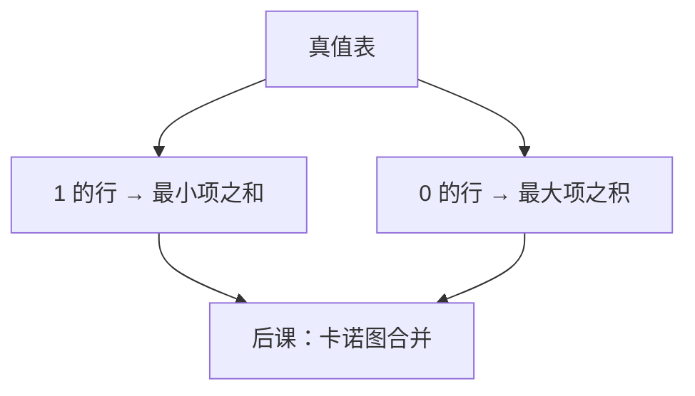

# 最小项与最大项

任意布尔函数都可以写成「恰好那些使它为真的输入点」的或；对偶地，也可以写成最大项的与。

<footer>—— 据 Harris and Harris, Digital Design and Computer Architecture 整理</footer>

上一课[德摩根与对偶](/cs/de-morgan)钉死了与、或、非可以等价变形。本课不重列交换律，也不从「什么是函数」另起。缺口是：公理保证能变形，还没有一张**标准写法**，把任一 $n$ 元函数从真值表翻译成式子。

## 问题

$n$ 个变量有 $2^n$ 行真值表。公理课没有说怎样机械地写出一个实现它的式。缺口因此不是新运算，而是构造：每个输入赋值对应一个**最小项**（全部变量出现，为真的取原变量、为假的取反），函数等于那些使 $f=1$ 的最小项之和。对偶：使 $f=0$ 的赋值对应最大项，函数等于它们的积。

这是规范展开，通常不是最短。化简是[卡诺图](/cs/karnaugh-map)的缺口。本课只钉「每个函数至少有这一份式子」，以便后课谈覆盖与无关项。

### 最小项不是「一项里变量最少」

名字里的「最小」指该项只在一个输入点为 1，不是字数最少。$abc$ 与 $ab$ 相比，前者才是三变量下的最小项。把「最短与项」当成最小项，后课卡诺圈会数错格子。

Harris 用 $\sum m(1,2,5)$ 记最小项之和，用 $\prod M(\cdot)$ 记最大项之积。两种规范式表示同一函数，门的极性不同：与或相对或与。

## 方法

对赋值 $a\in\{0,1\}^n$，最小项 $m_a(x)=\prod_i \ell_i$，其中 $x_i=a_i$ 时 $\ell_i=x_i$，否则 $\bar x_i$。则 $f(x)=\sum_{a:f(a)=1}m_a(x)$。最大项 $M_a$ 在 $a$ 处为 0、别处为 1，$f(x)=\prod_{a:f(a)=0}M_a(x)$。

枚举是完备的，也是指数代价。后课组合块（MUX、译码器）会直接实现「按编号选一行」，本课先把「一行 = 一个最小项」说清。

## 机制

规范式让综合有起点：PLA 的与平面就是最小项（或乘积项）阵列。后课不完全指定函数会留下「既不是 1 也不是 0 的行」，那些行不进入本课的和、积——那是无关项，下一课才允许拿来化简。本课默认函数完全指定。

规范式也给等价性一个判据：化成最小项之和再比较集合。代价高，但定义清楚。代数化简必须保持这个集合不变。

## 边界

本课不画卡诺图，不引入质蕴涵项算法（Quine–McCluskey），不谈多输出函数的共享乘积项。时序电路的激励函数也会写成这种式，但状态还没有对象。

后课默认：任一组合功能都有 SOP/POS 规范式；化简是在保留 1-集合（或 0-集合）的前提下合并项。

## 小结

- 最小项对应恰好一个输入点为 1；函数是其 1-集合的或。
- 最大项对偶；POS 与 SOP 表示同一完全指定函数。
- 「最小」不是「最短」；最短覆盖是后课。
- 出处：Harris and Harris, *Digital Design and Computer Architecture*。
