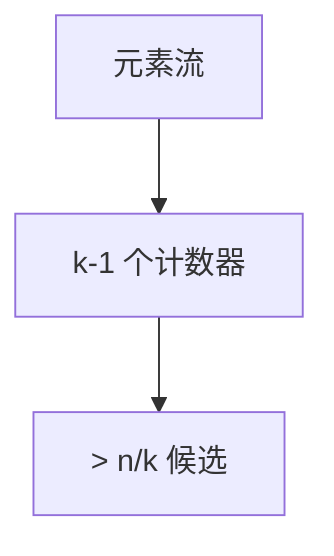

# 流算法 Misra–Gries

一遍扫描，$k-1$ 个计数器找出频率 $\gt n/k$ 的候选项；真频繁项不会漏，假阳性再扫或抽样验证。

<footer>—— 据 Misra and Gries, Finding Repeated Elements, 1982；Cormode and Hadjieleftheriou 流频繁项综述整理</footer>

上一课[模拟退火](/cs/simulated-annealing)收束元启发。图流课已说空间小。本课项流：宇宙很大，找频繁项。缺口是 Misra–Gries（与 Boyer–Moore 多数投票推广）。不重写半流图森林。后课外存 I/O。接[图流](/cs/graph-streaming)对象是边，本课是元素序列。

## 问题

长 $n$ 的流，找出现 $\gt n/k$ 的项（至多 $k-1$ 个真）。MG：维护 $\le k-1$ 个 (item,count)。新项已在则加；表满且不在则全体减 1，计数 0 的丢掉。真频繁项始终在表中（或结束时计数被低估但仍在）。Count-Min、SpaceSaving 点名。

缺口是固定 $k$ 空间，不是排序。

### 不是精确直方图

输出是候选。假阳性有。要精确再第二遍。不要声称一遍精确所有频率。

Misra–Gries 1982。Majority Boyer–Moore 是 $k=2$。后课外存是另一内存层次。

## 方法

$k$ 给定。一遍 MG。需要频率下界：$\hat f(e)\ge f(e)-n/k$。第二遍过滤。

并行多 $k$ 或分层。

## 机制

每次「全体减一」对应扔掉 $k$ 个不同项各一次，最多扔掉 $n/k$ 轮对某真频繁的伤害。与指纹：MG 确定；Count-Min 哈希 MC。与 Karger：都是小空间摘要，对象不同。

## 边界

本课不写全部 sketch 下界。不写分布式。后课默认：频繁项用 MG/SpaceSaving。下一课外存与 I/O 模型。

## 小结

- $k-1$ 计数器一遍流。
- 真 $\gt n/k$ 不漏；频率低估。
- 精确需第二遍。
- 出处：Misra and Gries, 1982。
