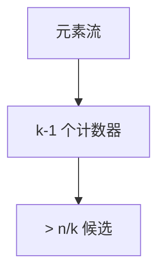

# 流算法 Misra–Gries

一遍扫描，$k-1$ 个计数器找出频率 $\gt n/k$ 的候选项；真频繁项不会漏，假阳性再扫或抽样验证。

<footer>—— 据 Misra and Gries, Finding Repeated Elements, 1982；Cormode and Hadjieleftheriou 流频繁项综述整理</footer>

上一课[模拟退火](/cs/simulated-annealing)收束元启发式。图流课已见识过「一遍流、小内存」的约束；本课换对象：元素流——宇宙（可能的不同项）很大，内存只装得下常数个计数器，要找频繁项。缺口是 Misra–Gries：Boyer–Moore 多数投票的推广。不重写半流图森林；后课外存 I/O。[图流](/cs/graph-streaming)的对象是边，本课是元素序列。

## 问题

长 $n$ 的流里，频率超过 $n/k$ 的项至多 $k-1$ 个——这既是空间下界，也说明 $k-1$ 个计数器刚好装得下候选。MG 维护至多 $k-1$ 个 (项, 计数)：新项已在表中就加一；表满且不在，就全体减一、删掉归零者。关键结论：频率 $\gt n/k$ 的真频繁项到流结束都不会被删光——计数可能被低估，但名字还在表里，因此输出是包含全部真频繁项的候选集。

直觉类比：MG 像一场圆桌抵消。桌上摆 $k-1$ 个杯子代表候选：老熟人来了往他杯里放一枚弹珠；生面孔来了且桌满，就所有杯子各拿走一枚（空杯撤走），生面孔同时被扔掉。每次冲突至少 $k$ 个不同项「各掉一滴血」，谁都别想白打。

Count-Min、SpaceSaving 点名。

缺口是固定 $k$ 空间，不是排序。

### 不是精确直方图

输出是候选不是答案：真频繁项不漏，但假阳性存在——冷门项也可能靠减剩的余数留在表里。估值只有单向下界 $\hat f(e)\ge f(e)-n/k$。要精确频率，拿候选列表再扫一遍原流数准；不要声称一遍就能给出所有项的精确频率。

Misra–Gries 1982。Majority Boyer–Moore 是 $k=2$。后课外存是另一内存层次。

## 方法

$k$ 给定后一遍 MG 扫完，产出至多 $k-1$ 个候选及其低估计数；每个候选带单向下界 $\hat f(e)\ge f(e)-n/k$。要滤掉假阳性，第二遍只对候选精确计数——候选至多 $k-1$ 个，这一遍的开销与流长无关地小。

```mermaid
flowchart TD
  STR["元素流"] --> MG["k-1 个计数器"]
  MG --> CAND["> n/k 候选"]
```

要更细的频率粒度，可对多个 $k$ 并行跑多套摘要，或按频率分层——本课只点名。

## 机制

精髓在「全体减一」：它不是随手清理，而是一次配对抵消——表内 $k-1$ 个不同项各减一，连同进不来的新项，恰是 $k$ 个不同项各被扔掉一次。全流共 $n$ 次出现，抵消至多 $n/k$ 轮，任何项至多被伤 $n/k$ 次；真频繁项出现 $\gt n/k$ 次，计数便降不到零——「真频繁项不漏」的全部证明就在这里，Boyer–Moore 多数投票是 $k=2$ 的特例。与指纹区分：MG 是确定性的，漏报为零；Count-Min 把项压进哈希桶，用 Markov 不等式换空间，误差是概率的。与 Karger 同属小空间摘要，但对象是元素流，不是图的割。

## 边界

本课不写 sketch 的全部空间下界，也不写分布式版（计数器要跨机汇总）。后课默认：频繁项用 MG 或 SpaceSaving。下一课外存与 I/O 模型。

## 小结

- $k-1$ 计数器一遍流。
- 真 $\gt n/k$ 不漏；频率低估。
- 精确需第二遍。
- 出处：Misra and Gries, 1982。
