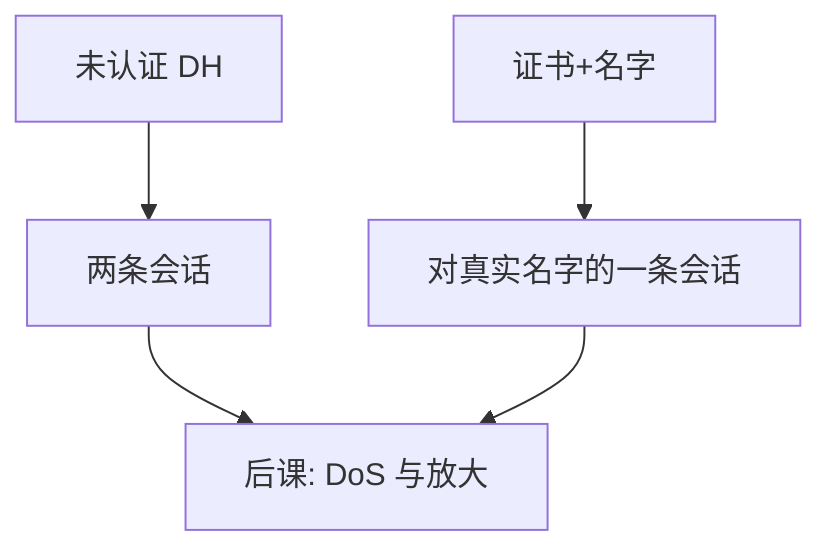

# 中间人

主动者插入路径，对两边各冒充对端；没有绑定名字的认证，加密只是与攻击者建了两条合法会话。

<footer>—— 据 Diffie–Hellman 原文对假冒的讨论；RFC 8446 用证书关掉这一缺口</footer>

[上一课](/cs/firewall-state)在边界上跟踪流。本课不重做流表。缺口是：威胁模型里的**主动者**可以转发、改、插入。[认证协议](/cs/firewall-state)已警告重放；这里专收「两条会话、一个中间」这一几何：若只做未认证的 DH，双方各自与中间人共享不同的密钥，CIA 的 C 与 I 对真实对端全部失败。

## 问题

被动窃听被 AEAD 挡住。主动者可以拆成两段 TLS：客户端以为连上银行，实际连上中间人，中间人再连银行。密码学仍然「成功」。缺口不是逐步说明如何插入网络，而是机制：未认证的密钥交换不区分对端；证书+名字+信任锚才把 $pk$ 绑到意图中的主体。证书钉扎、交互式指纹对照是锚不在根程序里时的带外手段。

本课不提供中间人工具、配置或操作步骤。课程只对照：认证失败或用户点掉警告时，TLS 几何上就是两条会话。

## 方法

防御：握手必须认证至少一侧（通常是服务器），Finished 绑密钥与对话。用户必须核对名字（浏览器 UI 的那一层也是协议的一部分）。企业 TLS 检查盒显式成为端点，应进入威胁模型而不是假装「还是端到端」。本课不讨论如何部署检查盒。

## 机制

中间人同时破坏保密（能读明文）与完整（能改）。对 2PC 一类协议，假冒参与者比崩溃更糟：原子性假设诚实节点。PKI 误签、用户忽略警告、时间错误导致证书「过期处理不当」，都会把模型打回未认证 DH。防火墙不能单独发现这种几何，除非它自己就是那一个中间人。

企业检查盒若终止 TLS，客户端必须改锚；否则它就是本课的中间人几何。

## 边界

不要把 ARP/DNS 欺骗的操作手册写进课文；只需知道名字系统与二层也会把流量送到错误下一跳，然后才轮到 TLS 认证来挡。也不要把「HTTPS 锁图标」当成完整的用户意图绑定。

用户点掉证书警告，等于把信任锚换成当前对端，模型退回未认证。后课默认：认证正确则中间人变不成静默的第三条会话；资源耗尽与放大仍能打断可用，那是 DoS。

名字绑定失败时，加密越强，用户越安心地把明文交给错误端点。认证不是加密的装饰，是几何上少一条会话的条件。

## 小结
- 未认证 DH 会得到两条「合法」会话；证书+名字把对端钉到意图中的主体。
- 后课 DoS 不需要假冒成功，只需要资源不对称。

- 防火墙管流；中间人是未认证或绑错名字的密钥交换几何。
- 证书把 DH 从「与某人共享」变成「与该名字共享」。
- 认证挡不住把链路灌满，可用轴交给 DoS。
- 出处：Diffie and Hellman, 1976；RFC 8446；Anderson。
