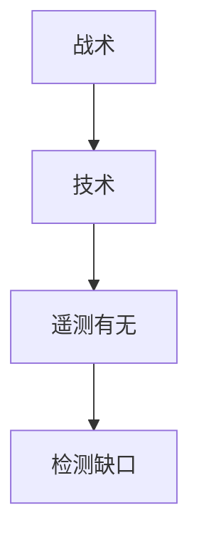

# ATT&CK

ATT&CK 把对手行为收成战术与技术矩阵，便于问检测覆盖而不是只问 CVE 列表。它是共同语言，不是自动等于你已被打穿。

<footer>—— MITRE ATT&CK；Strom 等对知识库的陈述</footer>

## 定位

上一课[事件响应](/cs/incident-response)要分类。缺口是**对手行为词典**。本课讲矩阵怎么用于覆盖缺口，不把技术条目写成操作步骤。

后课默认已经读完本课钉下的合同，只补差，不从该领域第一性原理重开。

## 问题

工单只写恶意软件名，检测对不上。ATT&CK：初始访问、执行、持久化等战术下挂技术。缺口是映射遥测：哪些技术我们根本看不见。

### 不是清单作业

覆盖 100% 技术既不可能也无意义。按威胁模型选。

MITRE。禁止按矩阵当攻击剧本。渗透测试下一课是授权下的检验。

## 方法

选相关战术，对照日志源。下一课渗透测试方法论。

图中节点是本课的机制骨架；课程不把图展开成可运行的攻击步骤。

## 机制

共同语言让蓝队与情报对接。渗透测试下一课用授权模拟来检验这些缺口。

前提写进合同之后，游戏外的误用只当失败模式点名，不在本课写成操作程序。

## 边界

不展开技术利用。渗透测试方法论下一课。

## 小结

- 响应需要分类语言；ATT&CK 给行为词典。
- 用来找检测缺口，不是打勾游戏。
- 按威胁模型选子集。
- 下一课渗透测试方法论。
- 出处：MITRE ATT&CK。
