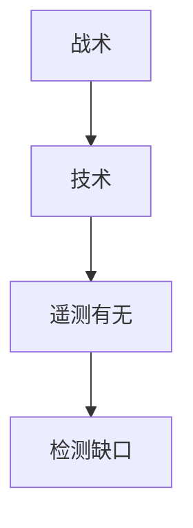
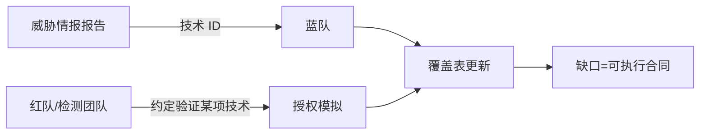

# ATT&CK

ATT&CK 把对手行为收成战术与技术矩阵，便于问检测覆盖而不是只问 CVE 列表。它是共同语言，不是自动等于你已被打穿。

<footer>—— MITRE ATT&CK；Strom 等对知识库的陈述</footer>

上一课[事件响应](/cs/incident-response)要求把对手行为定性成有名字的事件，名字从哪来？缺口是**对手行为词典**。本课讲矩阵怎么用于覆盖缺口，不把技术条目写成操作步骤。

后课默认已经读完本课钉下的合同，只补差，不从该领域第一性原理重开。

## 问题

工单写「中了某家族恶意软件」，换个家族检测就全对不上——产品名易变，行为才稳定。ATT&CK 把行为收成两层：战术是「对手要达成什么」（初始访问、执行、持久化、横移、外送等），战术下挂技术与子技术，是「具体怎么做」。有了词典才能做映射：把自家遥测逐条对到技术上，回答「哪些技术我们根本看不见」——比如没有进程命令行日志，相关执行类技术全是盲区。缺口是映射遥测，不是数条目。

直觉类比：战术像体检项目（心血管、呼吸……），技术像具体症状（某一种心律、某一处阴影）。医生不会把所有可能的病全查一遍，而是按你的年龄与暴露史选项目——对应「按威胁模型圈定战术，再补盲区」。

### 不是清单作业

覆盖 100% 技术既不可能也无意义：矩阵条目数以百计，全盯等于没盯。按威胁模型选子集——你所在行业最常见的对手惯用哪几条战术，就先补哪里。

MITRE。禁止按矩阵当攻击剧本。渗透测试下一课是授权下的检验。

## 方法

次序是先圈后对：按威胁模型圈定相关战术，再逐战术对照日志源——端点、身份、网络流——给每项技术标注「有遥测 / 有检测 / 全盲」，全盲项按可达性排序补齐。覆盖表要随 ATT&CK 年度修订与遥测变化更新，不是一次性的。下一课渗透测试方法论。

术语翻译：「遥测」就是安全传感器采集到的原始记录——进程命令行、登录日志、DNS 查询。日志源没开，对应技术的格子只能填「全盲」：不是检测规则写得差，是根本没有输入可看。

```mermaid
flowchart TD
  TAC["战术"] --> TECH["技术"]
  TECH --> TEL["遥测有无"]
  TEL --> GAP["检测缺口"]
```

## 机制

共同语言让蓝队与情报对接：威胁情报报告用同一套技术 ID 描述对手，蓝队可把报告直接翻译成覆盖表更新；红队与检测团队也能对着矩阵约定「这次验证某项技术」。缺口表由此成为可执行合同而不是年度汇报。渗透测试下一课用授权模拟来检验这些缺口是否真被看见。

常见误区：初学者容易把 ATT&CK 当成又一个 CVE 漏洞库。实际上它不登记漏洞编号，只描述「对手做了什么动作」——同一个技术（如命令行执行）可以借十个不同漏洞实现，检测针对的是动作而非漏洞。

```mermaid
flowchart LR
  INTEL["威胁情报报告"] -->|"技术 ID"| BLUE["蓝队"]
  BLUE --> COV["覆盖表更新"]
  RED["红队/检测团队"] -->|"约定验证某项技术"| TEST["授权模拟"]
  TEST --> COV
  COV --> GAPS["缺口=可执行合同"]
```

## 边界

不展开技术利用——矩阵是描述层，不是工具手册。渗透测试方法论下一课。

## 小结

- 响应需要分类语言；ATT&CK 给行为词典。
- 用来找检测缺口，不是打勾游戏。
- 按威胁模型选子集。
- 下一课渗透测试方法论。
- 出处：MITRE ATT&CK。
