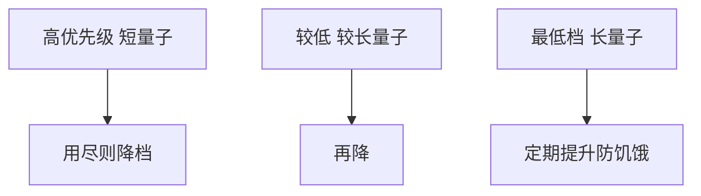

# 多级反馈队列

多级反馈用任务自己的近期行为当估计：用完量子就降档、更大片；经常阻塞就留在高档、短片——不必事先知道作业长度。

<footer>—— 据 Silberschatz et al., Operating System Concepts；Corbato 兼容时间共享系统的反馈调度整理</footer>

[上一课](/cs/rr-quantum)的单队列 RR 对所有人同一 $q$，也做不到 SJF 那种「短者先」——因为不知道谁短。缺口是 **MLFQ**：若干 RR 队列，优先级从高到低，量子从短到长；任务用完本档量子则降入下一档，阻塞或等待过久可再升。本课钉这套反馈，不当成某内核源码。

## 问题

SJF 要预言；RR 不预言也不偏向短作业（除了 I/O 型用不完片）。MLFQ 把「刚才用尽量子」当成「可能是 CPU 型」的证据，把它放到更长量子、更低优先级的队列，让高档留给像交互那样短跑就睡的人。缺口不是再调一个全局 $q$，而是**多条 runqueue 加迁移规则**。

饥饿：CPU 型降到最低档后，若高档一直有交互，低档可能长期摸不到 CPU。对策是定期提升，或保证低档仍有 CPU 份额。

## 方法

队列 $Q_0,Q_1,\ldots$：$Q_0$ 先被选，其内 RR。用尽 $q_i$ 降到 $Q_{i+1}$，$q_{i+1}>q_i$。阻塞离开时记住档位，唤醒回原档或升档（实现各异）。调度：总是跑当前非空的最高档。本课不把具体 $q_i$ 表当标准。

与[CPU 型与 I/O 型](/cs/cpu-vs-io-bound)对齐：反馈就是在线分类。

## 机制

MLFQ 用行为近似 SJF 且保持 RR 的响应：新任务或交互待在高档。规则必须防博弈：用户若每 $q-ε$ 主动让出以假装 I/O 型，会占住高档——教材承认启发式可被骗。内核若用睡眠时间而不是「是否自愿 yield」来升档，骗术弱一些。本课不写攻防细节。

## 边界

本课不是 Linux CFS：CFS 用虚拟时间而不是固定多档量子。也不把 Solaris 旧 MLFQ 参数当定律。优先级反转还没锁：下一课才把「高优先级等低优先级持锁」请进来。

后课默认：分时可以用反馈分档。一旦有锁，静态或反馈的优先级都会反转，下一课讲优先级反转。

## 小结

- MLFQ：多档 RR，用尽降档，近似短作业优先且不需预言。
- 须防低档饥饿与用户博弈。
- 锁引起的优先级反转是下一课。
- 出处：Silberschatz et al., *OSC*；Corbato et al. 时间共享系统。
