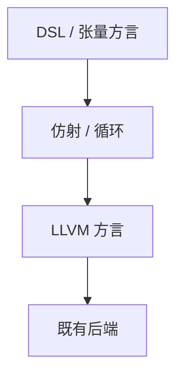

# MLIR 多层 IR

同一框架里并存多种方言：张量、循环、LLVM。下降是方言到方言的合法变换，而不是只在一种三地址 IR 上打遍。

<footer>—— 据 Lattner et al., MLIR: Scaling Compiler Infrastructure for Domain Specific Computation；对照龙书单层 IR 与[目标描述](/cs/target-description) 整理</footer>

上一课[Wasm](/cs/wasm-target) 是一个后端方言的归宿。缺口是**多层**：MLIR 让编译器基础设施服务 DSL 与硬件，而不把一切立刻降到 LLVM IR。本课钉方言与 lowering，DSL 下一课。不把神经网络训练当本栏正文——可点名张量方言存在，细节归大模型栏。

## 问题

龙书一条管道：源 → 三地址 → 机器。DSL 与加速器要在高层次做变换（融合、布局）。过早降到 LLVM 丢失结构。MLIR：op+类型在方言里，pass 管 lowering。缺口是**这一架构**，不是 Wasm 验证。

与多面体：affine 方言承接 SCoP。

### MLIR 不是「又一个 LLVM」

LLVM IR 是其方言之一。MLIR 是建 IR 的系统。不要把两者当同一文件格式。

Lattner 等 MLIR 论文与 LLVM 项目文档。对照 Appel 单 IR。本课不编造 arXiv 号。基础设施视角，不写具体加速器 ISA。

## 方法

定义方言（操作语义、验证器）。写 pass：canonicalization、lowering 到下一方言。最终 `llvm` 方言 → LLVM 模块 → 原有后端。

与[树匹配](/cs/tree-pattern-isel)：在低层仍做选择；高层做图变换。

## 机制

类型系统可依方言扩展（与 HM 不同，是编译器 IR 类型）。调试：位置信息跨 lowering 传递，难。不要一层 pass 偷偷改变内存模型而不声明。

## 边界

本课不写具体 DSL 嵌入语法。后课默认：多层方言下降是现代基础设施。下一课 DSL 与嵌入。

也不把 MLIR 当 XML。

## 小结

- MLIR：多方言、逐级 lowering，保住高层次结构。
- LLVM 是终点方言之一，不是唯一 IR。
- 服务 DSL 与硬件，不替代源语言类型系统课。
- 出处：Lattner et al. MLIR；LLVM 文档；对照龙书管道。
