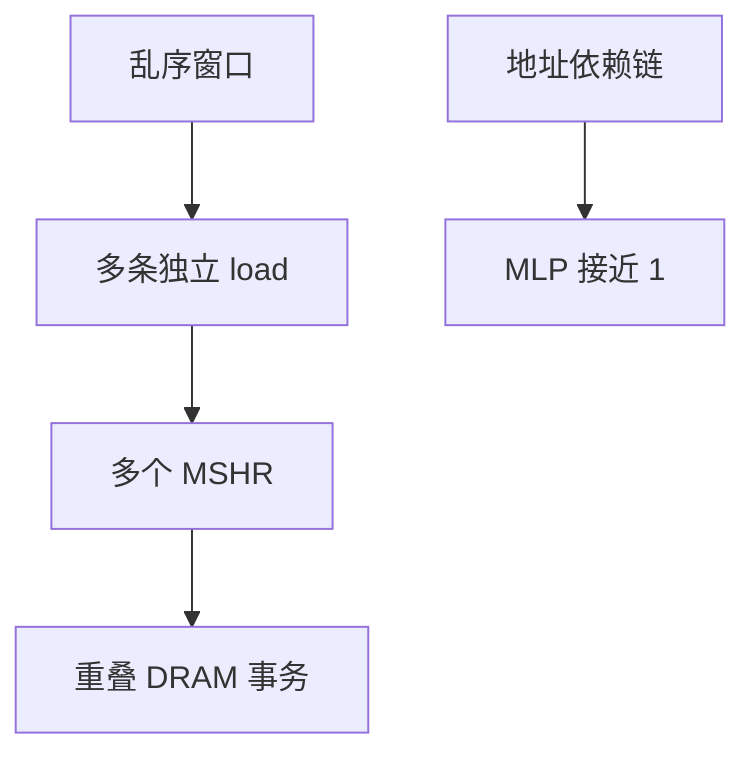

# 访存级并行 MLP

DRAM 延迟以百拍计；一条 load 卡住窗口时，若还能再发出几条独立缺失，有效延迟就被重叠摊薄。

<footer>—— 据 Glew 对 MLP 的命名；Chou, Jaleel, and Shen；Hennessy and Patterson, CA:AQA 整理</footer>

[上一课](/cs/victim-cache) 减少冲突往返。[MSHR](/cs/mshr) 已经允许同一时刻登记多个未完成块请求。本课不重画牺牲缓存。缺口是把**访存级并行（memory-level parallelism）**说成乱序核与 cache 层次的共同目标：窗口、ROB、MSHR、SQ 必须一起够大，才能让多趟 DRAM 重叠。

## 问题

单条 load 缺失的 CPI 贡献 ≈ 延迟。若窗口里还有独立的 load，它们的缺失可以同时飞，摊到每条指令上的平均延迟变成 $T / \mathrm{MLP}$。指针追逐 MLP≈1：数据依赖链把第二次地址算死。数组扫描可以很大。缺口不是再加一路 L1，而是**量化「同时未完成的缺失数」，并承认结构上限会先碰到。**

MLP 与 ILP 不同：ILP 是每拍完成几条指令，MLP 是同时有几趟访存在飞行。乱序的一大收益是提高 MLP，而不只是把 ALU 排满。

## 方法

MSHR 项数、未完成 L2/L3 miss 数、DRAM 控制器队列，取最小者为硬件 MLP 上限。编译与算法：把独立访存排进同一窗口（循环展开、软件流水），避免不必要的锁链。指针结构用预取或数据布局提高有效 MLP。

## 机制

[退休](/cs/retire-precise-exception) 头若被最年长的 miss 堵住，ROB 满会阻止更年轻的独立 load 进入窗口，MLP 上不去——「精确提交」与「重叠缺失」在这里打架。有的设计允许 miss 的 load 退休到一个更大的缓冲，但那放松的是实现，不是本课要改的 ISA 精确性定义。

预取把强制缺失变成提前的 MSHR 占用，看起来像提高 MLP，其实是把未来的需求拉进现在；错预取挤占真 MLP。下一课步长预取器专门发这些提前请求。

## 边界

本课不把 GPU 的大量 outstanding request 写成 CPU ROB 的替代——SIMT 有另一套延迟隐藏，后课。也不把量化交易系统的撮合延迟拉进来。目录协议的转发链会拉长单次 miss，降低有效 MLP。

后课默认：CPI 的访存项看延迟/MLP。有规律的地址流应该用预取去占 MSHR，而不是等需求 miss。

## 小结

- MLP 是同时飞行的缺失数；乱序窗口与 MSHR 共同设上限。
- ROB 头阻塞会扼杀 MLP。
- 步长与流预取是下一课主动提高飞行中请求的手段。
- 出处：Glew；Chou, Jaleel, Shen；Hennessy and Patterson, *CA:AQA*。
