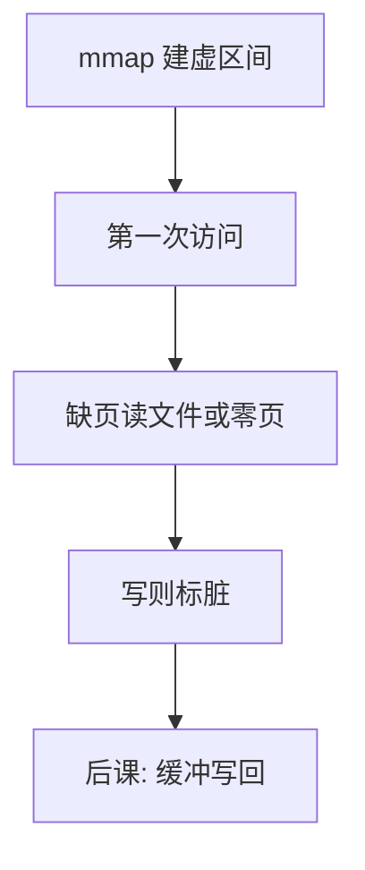

# mmap

把文件或匿名页映射进进程地址空间：访存即 I/O，缺页即按需读，脏页即延迟写回。

<footer>—— 据 POSIX mmap；Bach 与 Silberschatz 对内存映射文件的整理</footer>

[上一课](/cs/cow-fork)让页在进程间按写拆分。[地址空间布局](/cs/cow-fork)留出映射区。`read` 把文件拷进用户缓冲，再拷进堆，同一字节可能三份。[按需调页](/cs/demand-paging)已能在缺页时从文件填页。缺口是把文件**直接**接到虚地址：mmap。

## 问题

加载器对文本段实际上已经在做映射；用户还要对数据文件、共享库、匿名堆做同样的事。缺口不是新的磁盘格式，而是系统调用：选定虚区间、绑定文件偏移或匿名、权限、是否与其他进程共享。访问走普通 load/store；第一次触及才读磁盘；写脏后由内核在置换或 `msync` 时写回。

本课不把 `madvise` 的全部提示写完。

`MAP_SHARED` 写可见于文件与其他映射者；`MAP_PRIVATE` 对文件是 COW：写不污染文件，拆页与上一课相同。

## 方法

mmap 在 VMA（虚区间描述）里记下文件与偏移。缺页：算文件块，读入帧，填页表。共享映射的同一文件页可被多进程页表指向，像 fork 之前的共享，但来源是文件不是父进程。匿名 mmap 给堆、给线程栈后备，替代或补充 `brk`。

## 机制

mmap 把文件变成[局部性](/cs/locality-principle)可利用的页 Cache：热点页留在帧里，与后课缓冲脏页是同一层对象。相对 `read`，少一次用户缓冲拷贝。代价是：短请求的系统调用开销被换成缺页；错误（I/O 失败）出现在信号或下次故障，而不是 `read` 的返回值——边界里要承认。

动态链接的 `.so` 用共享 mmap 文本，多进程一份物理页，这是加载课与本课的接头。

## 边界

本课不把数据库用 mmap 当缓冲池的全部争议写完。不引入 `mmap` 与 64 位空洞的实现上限表。I/O 错误异步化是接口裂缝，主干点名即可。真正的「文件是什么」还没有：下一课才把文件收成字节流抽象。

文件尾延伸与映射长度不一致时，访问超出文件的页如何处理由实现规定；主干避免把映射做得比文件长还当普通堆。

后课默认：虚区间可以绑文件。文件作为内核对象如何命名、如何读写，下一课从字节流讲起。

## 小结

- mmap 把文件或匿名页接到虚地址；缺页即读。
- PRIVATE 是对文件的 COW；SHARED 写回文件。
- 文件对象本身是下一课的抽象。
- 出处：POSIX.1 mmap；Silberschatz et al., *OSC*；Bach, *UNIX*。
