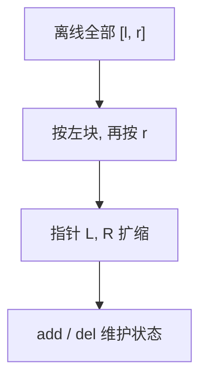

# 莫队算法

区间不能随问随答时，把所有询问按左端所在块排序、块内按右端排序，让指针每次只小步扩缩。

<footer>—— 据 Sedgewick and Wayne 对离线与分块的整理；竞赛文献中的 Mo's algorithm（莫涛）与分块排序</footer>

[上一课](/cs/sqrt-decomposition)的在线分块要求「加一个点、去一个点」的代价能收进摘要。若只有「把区间从 $[l,r]$ 扩成 $[l,r+1]$」这类 $\mathrm{add}/\mathrm{del}$ 便宜、却没有对数树，可以把**询问离线**重排。本课不重定义块长。缺口是莫队：对静态数组、可加减的区间状态，用块序最小化指针移动。

## 问题

$m$ 个询问 $[l_i,r_i]$，数组不变。维护当前 $[L,R]$ 上的状态（如不同颜色数），$\mathrm{add}(i)$、$\mathrm{del}(i)$ 为 $O(1)$ 或 $O(\log n)$。若按输入顺序跳，指针总移动可到 $\Theta(nm)$。莫队：块大小 $B$，询问按 $(\lfloor l/B\rfloor,\, r)$ 排序（偶数块 $r$ 反转可再省常数）。相邻询问的 $L,R$ 变化合计 $O(n\sqrt{m})$ 量级（$m\sim n$、$B\sim n/\sqrt{m}$ 时常见 $O(n\sqrt{n})$）。缺口不是新状态机，而是**离线重排降低扩缩次数**。

名称来自莫涛对分块排序技巧的普及。奇偶块翻转右端，减少块间 $R$ 来回扫，是同一分析下的常数优化。

## 方法

读入全部询问，排序，从空或任意区间出发，对每个询问 while 扩缩 $L,R$ 到目标，再记录答案。必须能逆：扩与缩都要正确，不能只 add 不能 del。

带修改莫队多一维时间块，复杂度更高，本课只钉静态。树上莫队把欧拉序当序列，机制仍是扩缩，本课不写。

## 机制

分析：左端每次询问最多动 $O(B)$，共 $O(mB)$；右端在同一块内单调，块间重置，共 $O(n\cdot n/B)$ 一类界。取 $B\approx n/\sqrt{m}$ 平衡。这是[摊还](/cs/amortized-analysis)合计，不是单次询问对数。

状态必须是「区间的可加减函数」。中位数若不能 $O(1)$ add/del，莫队帮不上，应换权值树或排序分块。

## 边界

在线算法不能用莫队（必须先收齐询问）。不可逆状态、强制在线、或修改穿插过多时退回树。不要把莫队写成「所有区间问题的默认解」。

区间查询课序还剩紧凑的位级集合表示：位图与稀疏集合，不是再一张排序表。

后课默认：静态离线、状态可加减，可按块序扩缩。位级并行的集合用 bitset。

## 小结

- 莫队：离线按块排序，指针扩缩均摊近 $O(n\sqrt{n})$。
- 要 add 与 del；数组静态。
- 位级集合是下一结构，不是另一套莫队。
- 出处：分块排序技巧；Sedgewick and Wayne；莫队作为该技巧的通行名。
