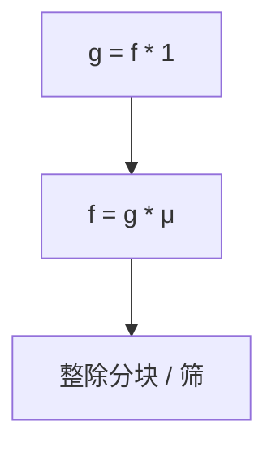

# 莫比乌斯反演

若 $g(n)=\sum_{d\mid n}f(d)$，则 $f(n)=\sum_{d\mid n}\mu(d)g(n/d)$；除数格上的卷积逆就是 $\mu$。

<footer>—— 据 Möbius；Apostol, Introduction to Analytic Number Theory；[欧拉函数与莫比乌斯](/cs/euler-mobius) 整理</footer>

上一课[生成函数](/cs/generating-functions)是 $n$ 的加法卷积。数论里常用**除数卷积**。$\varphi$ 课已给 $\mu$ 与 $\sum_{d\mid n}\mu(d)=[n=1]$。缺口是反演公式及其算法用：把「含倍数的计数」变成「恰好」的计数。不重写线性筛填 $\mu$。后课期望 DP 换概率。

## 问题

$g=f*\mathbf{1}$ 则 $f=g*\mu$。典型：$g(n)$ 为 $1..n$ 中满足「$d\mid\gcd$」的对数，$f$ 为 $\gcd=k$ 的个数。实现：枚举 $d\mid n$ 或整除分块（$\lfloor n/i\rfloor$ 段相同）做前缀 $\sum\mu$、$ \sum\varphi$。杜教筛点名：用恒等式在亚线性求积性前缀。

缺口是反演，不是 $\zeta(s)$。

### 不是容斥的对立面

容斥是子集格的 $\mu$；除数格是另一偏序。同一莫比乌斯函数在 $n$ 的因子格上取值正好是数论 $\mu$。点名 poset 即可，不写 Möbius 反演的范畴论。

Apostol 数论教科书。整除分块是算法课标准。后课期望 DP 用线性性，不靠 $\mu$。

## 方法

先写清 $g$ 与 $f$ 的卷积关系，再乘 $\mu$。需要 $1..n$ 前缀则筛 $\mu$ 或杜教。单点枚举因子 $O(\sqrt n)$。

注意 $*$ 是除数卷积不是生成函数乘。

## 机制

$\mathbf{1}*\mu=\varepsilon$ 单位 $[n=1]$，故左乘 $\mu$ 可逆。与容斥：$|A\cup B|=$ 先加后减，符号即 $\mu$。与 Lucas 无关。与 NTT：Dirichlet 卷积可用分治 FFT（DNTT 一类）点名，本课 $O(n\log n)$ 筛前缀已够许多题。

## 边界

本课不写杜教筛完整证明。不写格上一般 $\mu$。后课默认：倍数计数 $\leftrightarrow$ $\mu$ 反演。下一课概率与期望 DP。

## 小结

- 除数卷积的逆是 $\mu$。
- 把「整除条件」的求和换成精确 $f$。
- 与 OGF 卷积不是同一 $*$。
- 出处：Möbius；Apostol；$\mu$ 见 CLRS 第 31 章。
