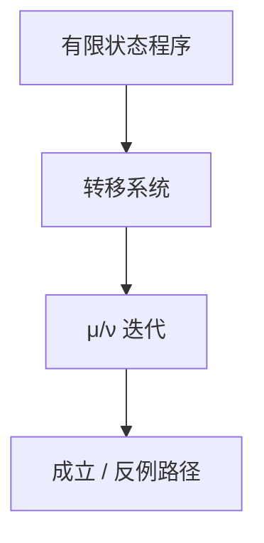

# 模型检验直觉

有限转移系统上，时序性质可算成标注或不动点迭代；对则给出路径证据，错则给反例路径。状态爆炸是边界，不是定义。

<footer>—— 据 Clarke, Emerson and Sifakis；Clarke, Grumberg and Peled, Model Checking 整理</footer>

上一课[Knaster–Tarski](/cs/knaster-tarski-fixpoint) 给出 $\mu$ 可迭代。缺口是**模型检验**：模型 $M$（Kripke / 转移图）+ 性质 $\varphi$，问 $M\models\varphi$。有限则算法；反例是调试接口。性质的逻辑 LTL/CTL 下一课，本课先钉流程与状态爆炸。

## 问题

状态：程序计数器 + 变量有限域。转移：语句一步。安全：坏态不可达——从初态 $\mu$ 后像，看交。活性：某事终发生——更要公平性与 $\nu$。显式检验：存全体可达。符号：BDD / SAT 表示集合。有界模型检验：把 $k$ 步路径编成 SAT，下一课 DPLL 吃它。

Hoare 要不变式；这里用穷尽（有限时）。无限整数、无限堆要抽象，否则非有限模型。

### 不是测试覆盖

覆盖率抽样本。模型检验相对给定有限模型是穷尽。模型若切掉中断或把 int 缩成 1 比特，穷尽的是切片，不是真机。

Clarke–Emerson、Queille–Sifakis 1980s，2007 图灵奖。CGP 教材。SPIN、NuSMV 是工具名，不是定义。状态爆炸：变量积。

## 方法

画三状态互斥，检验「不会同在临界区」。可达集合迭代到不动点。错时吐路径。指出：线程积指数，对称、偏序约减是工程，点名。

## 机制

验证补层的自动支路：不写证明，写模型+性质。与证明助手对偶。可靠性：工具实现要可信；性质写错会「检验通过」而无意义。公平性（进程无限常被调度）必须声明，否则活性假失败。

符号 BDD：状态集当布尔函数。BMC：路径约束成 SAT，完成本课只到「会调用求解器」。偏序约减、对称、锥约减是对抗爆炸的工程。公平性约束（弱/强）改变路径集合，活性公式必须带上，否则「永不调度」当反例。工具可信性是另一层（证明助手可核）。

## 边界

本课不写 CTL 语义全文（下一课），不引入时间自动机。不把硬件时钟树当模型。后课默认：有限 $M$ 上可自动判定许多时序性质，瓶颈是状态数。下一课 LTL / CTL。

穷尽的是给定有限模型，不是未切片的真机。反例路径是调试接口。状态积指数，故有符号方法与 SAT 有界展开。性质语言 LTL/CTL 下一课才选线性还是分支。

上一课留下的缺口在本课收口；「模型检验直觉」进入后课词汇表后只引用。文献用来钉对象与边界，不把本课写成该主题的独立综述。

## 小结

- 模型检验：有限转移系统 + 性质，不动点或 SAT。
- 错则反例路径；对则相对该模型穷尽。
- 状态爆炸与模型切片是边界。
- 后课先选 LTL 或 CTL，再谈具体算法。
- 出处：Clarke, Emerson, Sifakis；Clarke, Grumberg and Peled。
