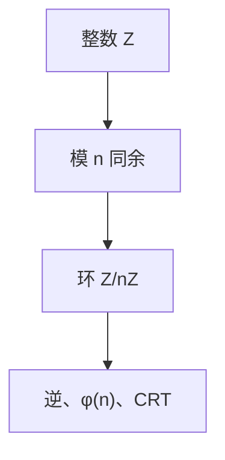

# 模运算与同余

$a\equiv b\pmod n$ 当 $n$ 整除 $a-b$；剩余类做成环 $\mathbb{Z}/n\mathbb{Z}$。密码学的加减乘都在这一层上，尚未求逆。

<footer>—— 据 Gauss, Disquisitiones Arithmeticae；Knuth, TAOCP 卷 2 整理</footer>

信息单元在[最大熵](/cs/max-entropy-principle) 结束。本单元是「密码学要用的那一层」，不是协议课。主干[对称密码](/cs/symmetric-crypto)、[DH](/cs/diffie-hellman-paper) 已经用过模幂，从未把同余写严。缺口从 **$a\bmod n$ 与剩余类**起。后课默认已读完本课的算术。

## 问题

整数除法余数：代表元取 $\{0,\ldots,n-1\}$。同余是等价关系，兼容加乘：可在类上定义运算。$\mathbb{Z}/n\mathbb{Z}$ 是环：有 $0,1$，加可逆，乘未必。$n$ 合数时有零因子（$2\cdot 3\equiv 0\pmod 6$），不能随意「两边同除」。本课不求乘逆——下一课扩展欧几里得。

计算机的机器字是 $n=2^{w}$ 的特殊情形；补码课已用，这里 $n$ 任意。

### 同余不是「余数相等」的口语

负元：$-1\equiv n-1$。编程语言的 `%` 对负数实现不一，数学上 $n\mathbb{Z}$ 陪集明确。不要把浮点取模当定理。

Gauss 的同余记号。Knuth 卷 2 讨论表示与快速幂。本课快速幂只点名：平方乘，后课欧拉定理才减指数。

## 方法

验证加乘良定义。写 $(\mathbb{Z}/n\mathbb{Z})^\times$ 为与 $n$ 互素的类——群结构后课。举 $n=15$ 看零因子。强调：方程 $ax\equiv b$ 何时有解，下一课 gcd。

## 机制

公钥课的对象（RSA 模 $n=pq$、DH 模 $p$）都是这个环或它的乘法群。本单元按需加结构，不在第一课上椭圆曲线。与[布尔代数](/cs/boolean-algebra) 对照：$n=2$ 时剩余类可当比特运算，但本课 $+$ 是模加，不是或。

快速幂平方乘：$O(\log e)$ 次模乘算 $a^e\bmod n$，后课欧拉再把 $e$ 先约到 $\varphi(n)$。表示：大整数用 $2^{32}$ 或 $2^{64}$ 字，与理论无关。$n=1$ 退化；密码模数奇数。本课加法逆永远存在（$n-a$），乘法逆下一课。

## 边界

本课不证唯一分解，不引入理想。不写 RSA。后课默认：谈到模运算，即剩余类环上的 $+$、$\cdot$。下一课 gcd 与逆。

剩余类环上加永远可逆，乘不一定。后课所有公钥算术都先落在这一层，再决定是当域还是当合数环。不要把机器字溢出当成一般 $n$ 的定理。

上一课留下的缺口在本课收口；「模运算与同余」进入后课词汇表后只引用。文献用来钉对象与边界，不把本课写成该主题的独立综述。

## 小结

- 同余是等价关系；$\mathbb{Z}/n\mathbb{Z}$ 是环。
- 合数模有零因子，不能随意约分。
- 协议课已用过；本课把算术钉严。
- 后课求逆、$\varphi(n)$、CRT 都默认本课的剩余类。
- 出处：Gauss, *Disquisitiones*；Knuth, TAOCP 卷 2。
