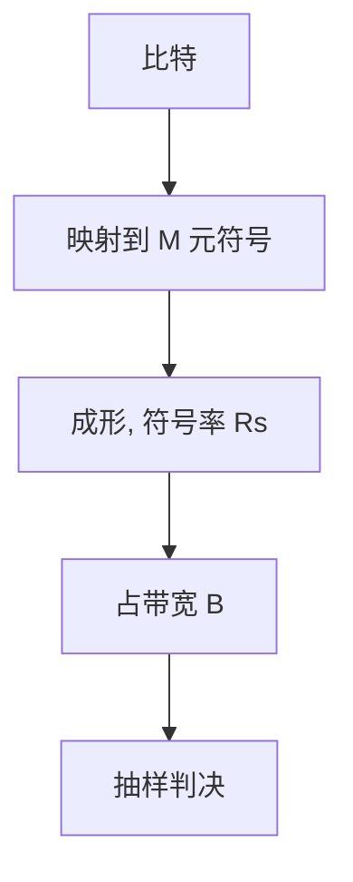

# 调制与符号率

波特是符号率，不是比特率；每符号 $\log_2 M$ 比特叠在同一带宽上，噪声一升就必须降阶。

<footer>—— 据 Proakis, Digital Communications；IEEE 802.3 各代 PAM / QAM 条款整理</footer>

[上一课](/cs/shannon-capacity-link)把一跳钉在 $C=B\log_2(1+\mathrm{SNR})$，还没有说波形怎么占 $B$。缺口是**调制**：基带 PAM、带通 QAM/PSK 把离散符号映到脉冲或载波；符号率 $R_s$ 与每符号比特共同决定毛比特率。本课不把 8B/10B 的游程写完。

## 问题

容量给上界，网卡发出的是连续时间波形。符号间隔 $T=1/R_s$，占用大约 $B\sim R_s/2$（升余弦等成形再加滚降）。同一 $R_s$ 上，$M$-PAM 每符号 $\log_2 M$ 比特，SNR 不够则星座点重叠。千兆铜缆用 PAM-5，更快的以太网用 PAM-4：每符号比特加倍，对噪声更苛刻——这是在 $C$ 下面移动工作点，不是改写香农公式。

比特率 $=R_s\cdot\log_2 M\cdot$ 码率。营销「10G」混着线路码开销，后课再拆。

Nyquist 脉冲保证无 ISI 的符号率上限。实际电缆有频率选择性，后课均衡与 FEC 补。本课只钉符号 vs 比特。

### 波特不是比特率

口头把 baud 说成 bit/s 会把 PAM-4 的每符号两比特算丢。本课之后「链路速率」默认指毛比特率，开销另扣。自适应降阶是改 $M$，不是改电缆。

## 方法

对照：NRZ（$M=2$）最省眼图，频谱宽；高阶 PAM/QAM 省带宽、要 SNR。画发送：比特 → 分组为符号 → 脉冲成形 → 介质。接收：匹配滤波、抽样、判决。不要把「波特率」口头说成比特率。

方法止于选定对象与对照；机制才说它如何嵌入已有分层与主干课。

## 机制

主干[CSMA 与交换](/cs/csma-switch)假定全双工链路上已有双向比特。那些比特来自本课的符号流。交换机背板后课再谈；这里只承认：端口「速率」是调制与码共同产物。无线后课的 OFDM 把同一思想搬到多载波，不在本课展开。

眼图闭合 = ISI 或噪声吃掉星座间距。降阶（从 PAM-4 回到 PAM-2）是自适应，不是协议错误。

## 边界

本课不推导匹配滤波器的充分统计量全文，不引入 Coset 编码。线路码的直流平衡与时钟含量是下一课。后课默认：毛比特率 = 符号率 × 每符号比特 × 码率。

调制不提供端到端可靠：判决错误交给 FEC 或上层重传。[端到端](/cs/layering-e2e) 仍在两端收口。

上一课留下的缺口在本课收口；「调制与符号率」进入后课词汇表后只引用。文献用来钉对象与边界，不把本课写成该主题的独立综述。下一课[线路编码 4B/5B、8B/10B](/cs/line-coding)。

## 小结

- 符号率（波特）占带宽；每符号比特由星座阶数决定。
- 高阶调制贴近 $C$，对 SNR 敏感。
- 「链路速率」已含这一层选择，尚未含 4B/5B 开销。
- 后课只引用本课钉死的对象，不从该领域总问题重开。
- 出处：Proakis；IEEE 802.3；Nyquist 成形。
