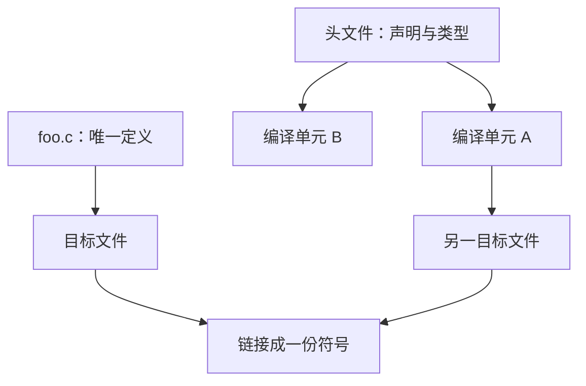

# 模块与头文件

每个源文件是一次独立翻译；头文件把声明复制进多个编译单元，链接阶段再把同名定义收成一份。

<footer>—— 据 ISO/IEC 9899；Kernighan & Ritchie, The C Programming Language, 2nd ed. 整理</footer>

上一课[函数作为抽象边界](/cs/fn-abstraction-boundary)把契约钉在函数上。本课不重讲前置条件，也不从包管理器另起。缺口是：分别编译已经在第一课出现，**调用方如何在看不见函数体时仍拿到正确的声明**。头文件是契约的可包含文本，不是「把代码放在 `.h` 里」。

## 问题

一个翻译单元看不到另一个 `.c` 里的定义，只能看见自己包含过的声明。若声明与定义不一致，编译器在本单元内无法发现，链接或运行时才爆。缺口因此不是 `#include` 的语法，而是**声明与定义的分工**：头文件放共享声明（函数原型、结构体类型、`extern` 变量），定义只出现在一个 `.c` 里。第一课的符号解析在这里变成日常纪律。

把函数定义写进头文件再被多处包含，会得到重复的强符号。内联函数与 `static` 定义有特殊规则，本课只点名：默认模型是「头文件无定义」。类型必须共享：结构体布局若在两个单元里声明得不同，就变成静默 ABI 破裂——上一课的布局契约跨过了文件边界。

### 头文件不是模块系统

C 的 `#include` 是文本插入，由[预处理器](/cs/preprocessor-preview)在更后课展开。它不提供命名空间、不导出可见性图、不防止循环依赖，只靠包含守卫避免同一文件在一次翻译里插两次。把 `.h` 理解成 Java 的 `package` 或后来的 C++ 模块，会期待编译器去解依赖图；本栏的构建系统课才会补「谁依赖谁」。

ISO C 的链接：外部链接的标识符在整个程序里指同一对象或函数。K&R 把程序拆成多文件，用头文件共享声明。本课不把 GNU 的可见性属性当主干。

## 方法

惯例：`foo.h` 声明 `foo` 的接口；`foo.c` 包含 `foo.h` 并给出定义——这让编译器核对原型是否自洽。调用方只包含 `foo.h`。全局变量用 `extern` 声明、单一 `.c` 定义。结构体若只通过指针使用，可以不完整类型：头文件里只写 `typedef struct Foo Foo;`，完整布局藏在 `.c` 里。这是 C 里封装的主要手段，后课不变量会用到。

包含守卫（`#ifndef`/`#define`/`#endif` 或 `#pragma once`）保证一次翻译内类型只定义一次。循环包含要用不完整类型或把共享类型抽到第三份头文件，而不是靠预处理器「聪明」。

公开头文件应最小：只放调用方需要的类型与函数。内部函数保持 `static` 或留在不安装的头里。这样版本历史里的公开差才短，审查才读得完。循环依赖常用不完整类型拆开：A 只持有 `B *`，B 的完整定义在别处。这与封装课将用的手法相同，本课先为了让编译顺序成立。预处理器稍后会解释守卫如何阻止同一头文件在一次翻译里插两次；守卫不解决两个头互相包含时的类型不完整问题，那要靠设计。

## 机制

分别编译能缩放程序，是因为每个单元只依赖头文件里的文本契约。代价是契约必须稳定：改结构体字段、改函数原型，所有包含者都要重编译——这是后课构建系统要跟踪的边。链接器只看见符号名，看不见 C 类型，所以类型错误跨单元时不会在链接期以类型形式出现。头文件的纪律就是在补链接器看不见的那一层。

构建系统稍后会把「谁包含了这份头文件」画成边：改布局则边的下游全部过期。若把定义藏进头文件并用 `static` 让每份翻译单元各有一份，符号不冲突，但程序里会出现多份独立静态状态，与「一个模块一份表」相反。内联与 `static inline` 是受控例外，必须保证所有包含者看见同一语义。链接器的弱符号可以合并，不应当用来掩盖「定义放错文件」。后课错误码会把失败语义也放进这份共享声明里，否则各单元会对失败有不同想象。

## 边界

本课不写预处理器宏的全部陷阱，不讲动态库的符号版本。下一课[错误码与失败](/cs/error-code-failure)把契约里「失败怎么办」补上。后课默认：声明进头文件、定义只一份；跨单元共享的是声明文本；布局不一致是静默错误。

## 小结

- 翻译单元独立编译；头文件复制声明，链接合并定义。
- 定义进一个 `.c`；重复包含定义会造成重复符号。
- 不完整类型让布局藏在实现文件里。
- 下一课在接口上表达失败。
- 出处：ISO C 链接；K&R 多文件程序。
