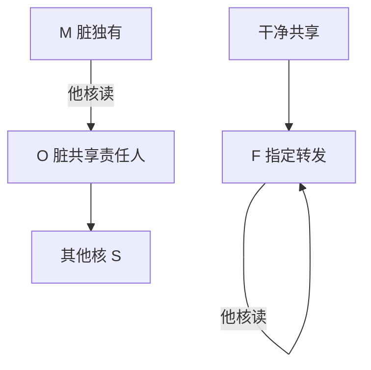

# MOESI 与 MESIF

脏数据不必先写回 LLC 再给请求者：Owned 允许共享脏副本并指定一个责任人；Forward 指定谁来响应共享读，避免所有 S 一起抢答。

<footer>—— 据 Sweazey and Smith；AMD64 对 MOESI 的描述；Intel 对 MESIF 的描述 整理</footer>

[上一课](/cs/hugepage-tlb-reach) 放大单核翻译。多核上 [MESI](/cs/mesi-protocol) 已经保证至多一份 M。脏行被他核读时，MESI 通常写回再双方变 S——LLC 与内存带宽被打满。本课不重画四态。缺口是**O（Owned）与 F（Forward）：共享时仍能指出数据从哪来、脏责任在谁。**

## 问题

核 A 持有 M，核 B 读同一行：数据在 A 的 L1 里最新。若必须先写到 LLC，延迟和功耗都高。MOESI 加 Owned：脏且可共享，O 核负责将来写回，其他核为 S。MESIF 加 Forward：干净共享时指定一个 F 核响应后续读，避免监听风暴里所有 S 重复提供。缺口不是分区，而是**五态机减少写回与重复响应。**

MOESI 常见于 AMD 窥探/Infinity。MESIF 用于 Intel QPI/UPI：F 是干净共享的指定转发者。二者都不是内存模型，只是副本放置。

## 方法

MOESI：M 被他核读 → 提供者变 O，请求者变 S，数据直接 cache-to-cache，内存可暂不更新。O 被写或替换则写回。MESIF：S 集合里指定 F；后续共享读由 F 提供，其余 S 沉默。

## 机制

不变式仍是：可写副本至多一份（M 或即将升级者）；脏至多一份责任人（M 或 O）。[退休](/cs/retire-precise-exception) 的 store 仍只有提交后才进入这些状态。cache-to-cache 把 [MLP](/cs/mlp-memory-parallelism) 的 miss 延迟从 DRAM 变成核间互联，后课 socket 互连会再放大这段。

伪共享不因 O/F 消失：行粒度还在，只是颠簸走核间而不是 DRAM。

## 边界

本课不把目录里的「owner 指针」写完，下一课目录扩展性会把窥探广播换掉。也不把 ARM 的 MOESI 变体逐比特对照。原子操作如何在这些态上锁 cache 行，是后课。

后课默认：共享脏可以不立即写内存；指定转发者减少重复应答。核数再涨，广播监听本身不可扩展。

## 小结

- MOESI 的 O 允许共享脏；MESIF 的 F 指定干净共享的响应者。
- 协议管副本，不管多地址顺序。
- 目录如何避免广播，是下一课扩展性。
- 出处：Sweazey and Smith；AMD MOESI；Intel MESIF。
