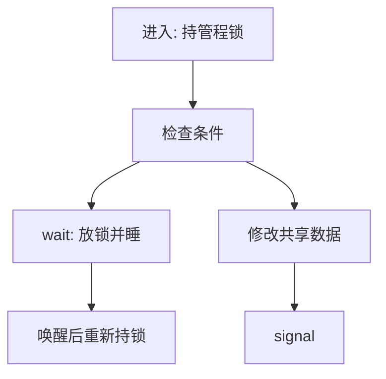

# 管程与条件变量

管程把共享数据与操作它的过程包在一起；过程在管程内互斥执行，条件变量用于等待不变量重新成立。

<footer>—— 据 Hoare, Monitors: An Operating System Structuring Concept, CACM 1974 整理</footer>

[上一课](/cs/semaphore)能计数等待，但 P/V 散落在各处，编译器看不见「哪把锁护哪块数据」。缺口是语言级模块：进入即持锁，退出即放锁，等待改写成条件变量。本课钉管程与 `wait`/`signal`，不把死锁图谱画完。

## 问题

用三个信号量实现有界缓冲，容易 V 错对象。管程约定：模块内任意时刻至多一个活动过程（互斥自动）。当不变量暂时不成立（缓冲空），过程在条件变量上等待——等待必须**释放管程锁**，否则无人能生产。缺口是这套括号，不是新的硬件原子。

Hoare 语义：`signal` 立即切到等待者，信号方暂停。Mesa/Java 语义：`signal` 只唤醒，被唤醒者回头再检查条件。主干标明差别，实现课默认 Mesa：等待必须写成循环。

条件变量本身不记布尔值。布尔在管程的普通变量里；条件变量只是等待队列的名字。

## 方法

进入管程 = 获得隐含互斥。`wait(c)`：释放互斥，挂到 $c$，被唤醒后重新获得互斥。`signal(c)` / `broadcast(c)`：唤醒一个或全部。有界缓冲的 `put`/`get` 都在管程内，空与满各用一个条件变量。

## 机制

管程把[临界区](/cs/race-critical)变成类型边界：模块外碰不到裸计数。条件等待把「互斥」与「等某谓词」拆开，避免用信号量兼做两职时的协议错误。内核里的等待队列加睡眠锁，是管程的手写版；POSIX `pthread_cond` 是用户版。

与信号量相比，谁该被唤醒由条件变量指名，而不是「任意 V」。广播可能惊群，这是性能边界，不是语义必须。

## 边界

本课不把 Java `synchronized` 与 `Lock` 的全部 API 对照完，不引入无锁 condvar。Hoare 立即切换在当代运行时少见，读论文时不要默认 Linux 是 Hoare。死锁仍可能：两个管程各等对方，四个条件下一课才列。

嵌套管程调用会重入锁或死锁，语言实现必须规定；教学默认过程不跨越两个管程持锁。

后课默认：共享对象可用管程括号；`wait` 写在循环里（Mesa）。同步原语互等导致永久阻塞，下一课用 Coffman 条件刻画。

## 小结

- 管程 = 数据 + 互斥过程；条件变量只是等待队列。
- Mesa：唤醒后重新检查谓词。
- 跨对象互等仍可死锁。
- 出处：Hoare, *CACM* 1974；Lampson and Redell, Mesa, 1980（Mesa 语义）。
