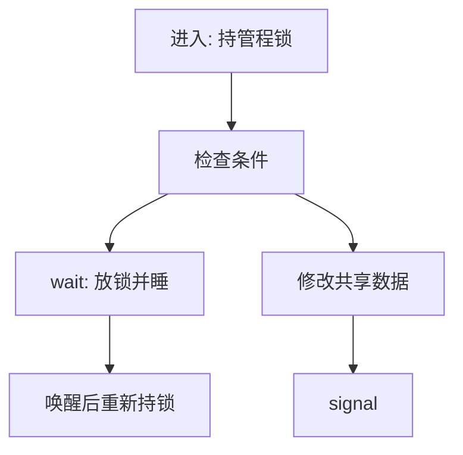
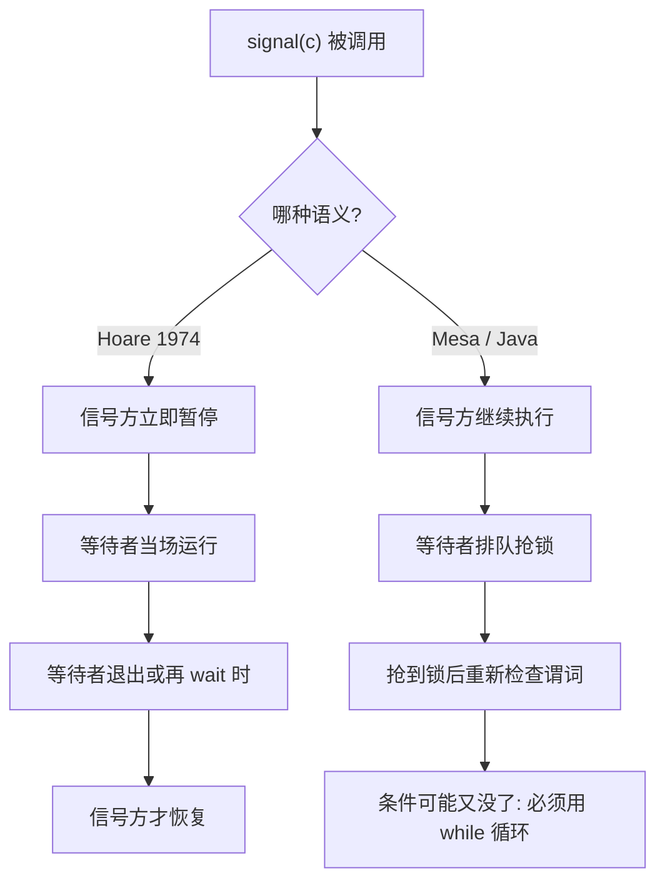

# 管程与条件变量

管程把共享数据与操作它的过程包在一起；过程在管程内互斥执行，条件变量用于等待不变量重新成立。

<footer>—— 据 Hoare, Monitors: An Operating System Structuring Concept, CACM 1974 整理</footer>

[上一课](/cs/semaphore)能计数等待，但 P/V 散落在各处，编译器看不见「哪把锁护哪块数据」。缺口是语言级模块：进入即持锁，退出即放锁，等待改写成条件变量。本课钉管程与 `wait`/`signal`，不把死锁图谱画完。

## 问题

用三个信号量实现有界缓冲，容易 V 错对象。管程约定：模块内任意时刻至多一个活动过程（互斥自动）。当不变量暂时不成立（缓冲空），过程在条件变量上等待——等待必须**释放管程锁**，否则无人能生产。缺口是这套括号，不是新的硬件原子。

Hoare 语义：`signal` 立即切到等待者，信号方暂停。Mesa/Java 语义：`signal` 只唤醒，被唤醒者回头再检查条件。主干标明差别，实现课默认 Mesa：等待必须写成循环。

条件变量本身不记布尔值。布尔在管程的普通变量里；条件变量只是等待队列的名字。

## 方法

进入管程 = 获得隐含互斥。`wait(c)`：释放互斥，挂到 $c$，被唤醒后重新获得互斥。`signal(c)` / `broadcast(c)`：唤醒一个或全部。有界缓冲的 `put`/`get` 都在管程内，空与满各用一个条件变量。

拿容量 $N=4$ 的有界缓冲代入：队列里已有 4 个元素时 `put` 走 `wait(notFull)`——空位数是 0；消费者取走一个后 `signal(notFull)`，生产者醒来看到空位数为 1，写入成功。空与满各配一个条件变量，谁在等什么一目了然。

```mermaid
flowchart TD
  ENTER["进入: 持管程锁"] --> CHECK["检查条件"]
  CHECK --> WAIT["wait: 放锁并睡"]
  WAIT --> RE["唤醒后重新持锁"]
  CHECK --> BODY["修改共享数据"]
  BODY --> SIG["signal"]
```

## 机制

管程把[临界区](/cs/race-critical)变成类型边界：模块外碰不到裸计数。条件等待把「互斥」与「等某谓词」拆开，避免用信号量兼做两职时的协议错误。内核里的等待队列加睡眠锁，是管程的手写版；POSIX `pthread_cond` 是用户版。

与信号量相比，谁该被唤醒由条件变量指名，而不是「任意 V」。广播可能惊群，这是性能边界，不是语义必须。

```mermaid
flowchart TD
  SIG["signal(c) 被调用"] --> Q{"哪种语义?"}
  Q -->|"Hoare 1974"| H1["信号方立即暂停"]
  H1 --> H2["等待者当场运行"]
  H2 --> H3["等待者退出或再 wait 时"]
  H3 --> H4["信号方才恢复"]
  Q -->|"Mesa / Java"| M1["信号方继续执行"]
  M1 --> M2["等待者排队抢锁"]
  M2 --> M3["抢到锁后重新检查谓词"]
  M3 --> M4["条件可能又没了: 必须用 while 循环"]
```

惊群就是一次唤醒把整条等待队列上的人都叫起来，结果只有一个人真正拿到活干，其余人白白消耗了一次加锁-检查-再睡的往返。广播语义正确但昂贵，能指名单个等待者时就用 signal。

## 边界

本课不把 Java `synchronized` 与 `Lock` 的全部 API 对照完，不引入无锁 condvar。Hoare 立即切换在当代运行时少见，读论文时不要默认 Linux 是 Hoare。死锁仍可能：两个管程各等对方，四个条件下一课才列。

嵌套管程调用会重入锁或死锁，语言实现必须规定；教学默认过程不跨越两个管程持锁。

初学者容易以为进了管程就进了保险箱、不会再死锁。实际上两个管程各持自己的锁再等对方的条件变量时，四个 Coffman 条件照样成立——管程消灭的是「忘记放锁」这类协议错误，不是循环等待本身。

后课默认：共享对象可用管程括号；`wait` 写在循环里（Mesa）。同步原语互等导致永久阻塞，下一课用 Coffman 条件刻画。

## 小结

- 管程 = 数据 + 互斥过程；条件变量只是等待队列。
- Mesa：唤醒后重新检查谓词。
- 跨对象互等仍可死锁。
- 出处：Hoare, *CACM* 1974；Lampson and Redell, Mesa, 1980（Mesa 语义）。
