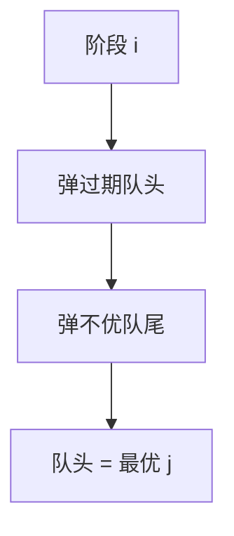

# 单调队列优化

转移 $dp[i]=\min_{j\in[i-w,i)} (dp[j]+c[j])$ 且候选随 $i$ 滑动时，队头过期、队尾维护单调，均摊 $O(1)$ 转移。

<footer>—— 据 Knuth TAOCP 与滑动窗口最小值；CLRS 第 15 章 DP 整理</footer>

上一课[数位 DP](/cs/digit-dp)沿位数。数值 DP 常 $O(n^2)$ 枚举切点。缺口是窗口内最值：单调队列（deque）维护下标递增、键单调。不重写数位自动机。后课斜率优化窗口变成凸包。

## 问题

$dp[i]=\min_{i-w\le j<i} dp[j]+b[i]$（$b$ 与 $j$ 无关）即滑动 $\min$。队头弹出 $j\le i-w$，队尾弹出不如新 $i-1$ 的。每个下标进出一次，$O(n)$。$c[j]$ 依赖 $j$ 时键为 $dp[j]+c[j]$，同样单调队列若比较与 $i$ 无关。

若决策 $j$ 的优劣随 $i$ 交叉（斜率），本课不够，下一课 CHT。

### 不是优先队列

优先队列给全局最值，删过期要惰性。窗口滑动用双端队列更干净。不要一上来堆。

滑动窗口最小值是经典。多重背包二进制/单调队列是应用。后课凸包维护与 $i$ 相关的比较。

## 方法

递增下标队列。转移前弹头弹尾，取队头为最优 $j$。背包：容量滚动 + 余数分组队列。

键必须与队内比较无关 $i$，或随 $i$ 同向移动。

## 机制

若 $j_1<j_2$ 且 $j_2$ 不差于 $j_1$，则 $j_1$ 永不再优，可从尾删。窗口左端单调，从头删。均摊线性。与树状数组：窗口最值也可用 ST 表 $O(1)$，但单调队列 $O(n)$ 预处理零、在线友好。

## 边界

本课不写决策单调的分治（后课）。不写三维单调队列。后课默认：滑动窗口最值转移用单调队列。下一课斜率优化。

## 小结

- 窗口最值：双端队列均摊 $O(1)$。
- 决策交叉则换斜率/分治。
- 每个下标进出一次。
- 出处：滑动窗口与 Knuth 队列思想；CLRS DP。
