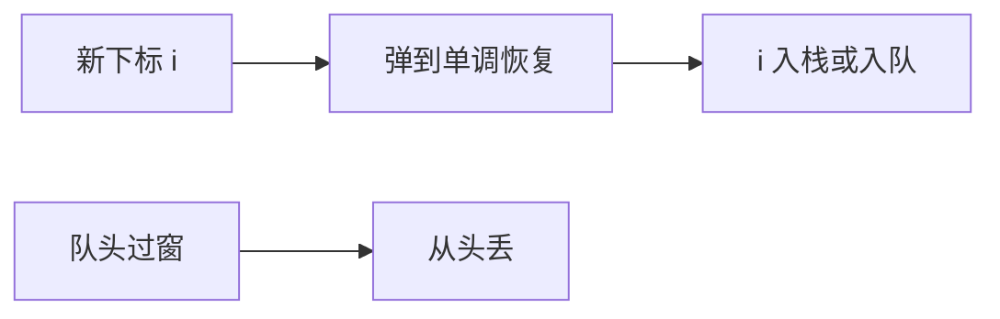
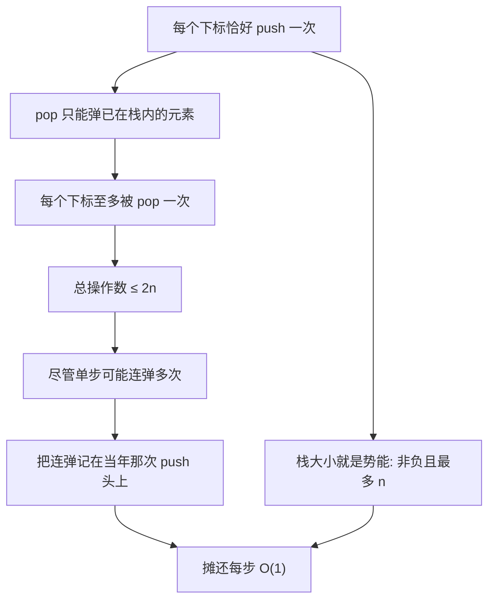

# 单调栈与单调队列

从左扫到右，栈里只留「还可能成为下一次最值或最近更矮柱」的下标；过期的从队头丢掉，新来的从队尾挤掉更差的。

<footer>—— 据 Knuth, The Art of Computer Programming；Sedgewick and Wayne；Cormen, Leiserson, Rivest and Stein 整理</footer>

[上一课](/cs/persistent-segment-tree)用树回答任意历史区间。许多问题其实只扫一遍：每个位置找左边第一个更小，或滑动窗口最小值。用线段树是 $O(n\log n)$ 杀鸡。[双端队列](/cs/deque)已经提供两端 $O(1)$。本课不重开路径复制。缺口是单调栈/单调队列：维护候选下标的单调性，摊还 $O(n)$。

## 问题

直方图最大矩形、接雨水、每个元素的最近更小，都要「左边最近的严格更小下标」。暴力向左扫最坏 $\Theta(n^2)$。缺口是：下标从左入栈，保持栈中 $A$ 单调（例如递增）；新来的 $i$ 不断弹到栈顶 $\lt A[i]$，此时栈顶就是 $i$ 的左边界。每个下标至多进栈出栈一次，合计 $\Theta(n)$。

滑动窗口 $[i-k+1,i]$ 的最值：队头过期（下标 $\le i-k$）弹出；队尾若比新元素更差（更不可能当窗口最值）则弹，再把 $i$ 入队。队头即当前最值下标。

代入 $A=[3,1,4]$ 找「左边第一个更小」：处理 3 时栈空，左边界不存在；处理 1 时把 3 弹掉（3 比 1 高，挡不住更矮的），栈仍空；处理 4 时栈顶是 1，不动——于是三个位置的答案分别是 无、无、下标 1，每步只比较了一两次。

「单调」指结构内存的键或值单调，不是指输入已排序。窗口队列要 deque，单端栈不够弹头。

## 方法

栈：数组当下标栈即可，不必链表。队列：与[deque](/cs/deque) 合同一致，头出过期、尾出劣解。严格与非严格比较决定「相等时谁留下」，合同要写清，否则边界差一。

```mermaid
flowchart LR
  I["新下标 i"] --> POP["弹到单调恢复"]
  POP --> PUSH["i 入栈或入队"]
  HEAD["队头过窗"] --> DROP["从头丢"]
```

与线段树：这里不支持任意 $[l,r]$ 事后查询，只支持扫描过程中的近邻或固定窗口。需要任意 RMQ 仍用稀疏表或树。

## 机制

摊还：每次弹是此前某次 push 的对应。势能可用栈大小。正确性：被弹掉的要么过期，要么中间有更好的候选挡着，后面窗口/近邻不会再需要它。

```mermaid
flowchart TD
  A["每个下标恰好 push 一次"] --> B["pop 只能弹已在栈内的元素"]
  B --> C["每个下标至多被 pop 一次"]
  C --> D["总操作数 ≤ 2n"]
  D --> E["尽管单步可能连弹多次"]
  E --> F["把连弹记在当年那次 push 头上"]
  F --> G["摊还每步 O(1)"]
  A --> H["栈大小就是势能: 非负且最多 n"]
  H --> G
```

为什么单步最坏 $O(n)$ 却敢说总代价 $O(n)$：可以把它想象成「储值卡」——每次 push 存一块钱进栈里，将来把它弹出去时就花这一块钱。弹的操作早已被那次 push 预付，全程总收入只有 $n$ 块，总支出自然超不过 $n$ 块。

这是序列扫描技巧，不是平衡树。局部性好：栈/队列是连续下标数组。不要在教学里用单调栈去「替代」可更新 RMQ。

## 边界

本课不把笛卡尔树、或单调栈优化 DP 的全部转移式写完。只钉结构合同。二维、任意子矩阵最值不是扫一遍能结束的。下一课分块：当查询形状不规则、又要在线改一部分时，用 $\sqrt{n}$ 折中。

后课默认：近邻与滑动窗口最值先想单调栈/队列。更杂的区间统计用分块或树。

初学者容易以为单调栈是「更强的线段树」，什么区间问题都能接。实际上它只回答扫描方向上的近邻与固定窗口最值，事后任意 $[l,r]$ 查询它做不到——这时候要换稀疏表或树，别硬套。

## 小结

- 单调栈：$O(n)$ 最近更小/更大。
- 单调队列：滑动窗口最值，头过期尾淘汰。
- 任意区间与更新仍要树或分块。
- 出处：Knuth；Sedgewick and Wayne；Cormen et al.。
