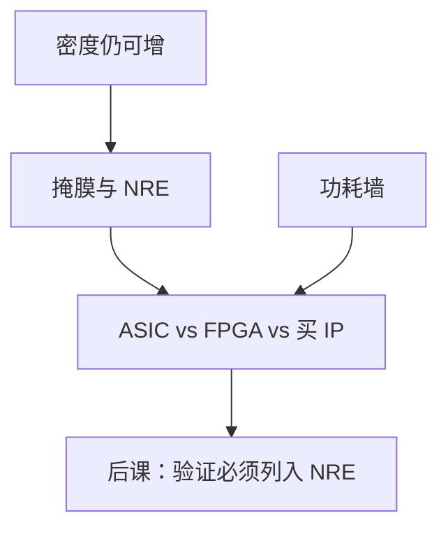

# 摩尔定律的经济学

  
摩尔说的是单位成本下晶体管数的指数增长；墙之后密度仍可能涨，但掩膜、EDA 与验证的费用把「同一笔钱买到的性能」换成另一条曲线。

  <footer>—— 据 Moore, Cramming More Components onto Integrated Circuits, Electronics 1965；Hennessy and Patterson, CA:AQA 整理</footer>

[上一课](/cs/dennard-power-wall)把电场缩放与功耗墙分开。Moore 1965 的观察是**经济学**：芯片上晶体管数目按规律涨，因为这样划算。缺口是：NRE（设计、掩膜、软件）与每片硅成本如何决定「还要不要做新 ASIC」，以及 FPGA/标准单元/HLS 在成本曲线上的位置。

## 问题

晶体管更小不一定更便宜：EUV 掩膜套数、设计规则复杂度、验证周期都涨。缺口不是再讲 $CV^2f$，而是：**固定成本**摊到多少颗、多长产品寿命。数字系统课在此收一口：算术单元与接口能做，不意味着每代都值得全定制。

FPGA 摊掉掩膜，用面积/功耗换上市时间。HLS 降 RTL 人月，不降 P&R 许可证与 STA 角。多核复用同一设计摊 NRE，对照功耗墙的并行。

### 摩尔定律不是性能定律

原文与后来的 Intel 表述围绕密度与成本。性能还要过 Dennard、存储墙、互连。把「每 18 个月翻倍」直接写成频率翻倍，与上一课矛盾，也与 DRAM 延迟曲线矛盾——后一单元内存会看见。

Moore, *Electronics*, 1965。CA:AQA 讨论成本、良率与工艺。本课不引用虚构的咨询报告数字；定性曲线足够。

## 方法

成本粗分：NRE / 件数 + 晶圆+封装测试。良率随面积指数变差，大芯片贵。平台化：同一 SoC 多 SKU 关单元（暗硅的市场版）。接口标准（后课 DDR、PCIe）让 PHY IP 摊到全行业，降低每家的模拟设计费用。

后课验证、DFT、BIST 都是 NRE 的一部分：少测会把成本赶到现场失效。

## 机制

本课序的 HDL 路径到此从「如何做」兼及「为何有时不做」。内存与 PCIe 单元假设多数设计者**买 IP**，自己做控制器调度与软件，而不是从晶体管画 DDR PHY。ISA 对照同理：授权与生态也是经济学。

## 边界

本课不预测某代工艺的晶圆报价，不讨论出口管制。不把股市当文献。不进入光刻机产能。量化金融定价不是本栏。

后课默认：密度趋势与「更便宜的性能」已脱钩；验证与 IP 是成本一等公民。

## 小结

- Moore 原意是成本–密度；不是频率定律。
- NRE 与掩膜把全定制门槛抬高；FPGA/IP 是回应。
- 下一课起把验证计入这条成本。
- 出处：Moore, *Electronics*, 1965；Hennessy and Patterson, CA:AQA。
