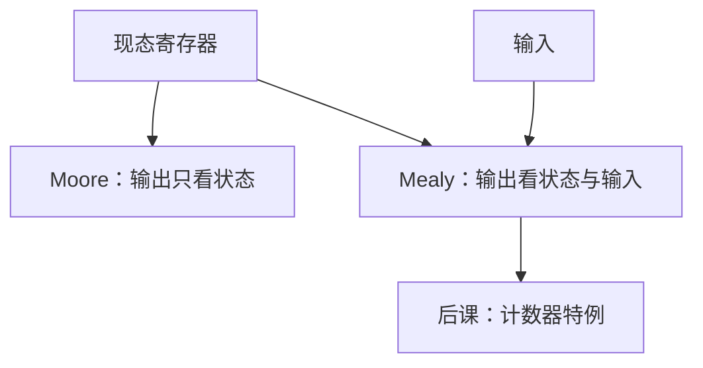

# Moore 与 Mealy

输出只看现态，则毛刺少、往往晚一拍；输出还看输入，则组合路径穿过控制器，可能更快也更险。

<footer>—— 据 Harris and Harris, Digital Design and Computer Architecture 整理</footer>

上一课[有限状态机](/cs/fsm-control)已经写出 $\delta$ 与 $\lambda$，并点了 Moore/Mealy 的差别。本课不重列编码，也不从正则语言另起。缺口是把两种输出接到**关键路径与毛刺**上：后课 CPU 控制器、总线应答，必须选哪一种，不能停在「两种都承认」。

## 问题

Moore：$\lambda:S\to$ 输出，输出随状态寄存器，边沿后才变。Mealy：$\lambda:S\times\Sigma\to$ 输出，输入一变输出就可以变，不必等下一拍。缺口是时序：Mealy 把输入到输出的组合算进[关键路径](/cs/critical-path)，并可能把输入毛刺送到输出；Moore 多一拍延迟，输出在周期内稳定（除边沿附近）。

混合常见：若干位 Moore（使能、选通），若干位 Mealy（提前应答）。本课钉分类，不把状态最小化算法写完。

### Mealy 不是「更高级的 FSM」

不是表达能力分层。任何 Mealy 可改造成 Moore（加状态、加一拍）。把 Mealy 当更现代，后课会把所有控制做成输入组合，保持时间更容易坏。

Harris 用序列检测对比：Mealy 可在输入到达当拍出「已匹配」。CPU 的 MemRead 等常同步到状态，避免组合读脉冲切到存储器中途。

## 方法

同一规格画两张图：Moore 把输出标在圈上，Mealy 标在边上。综合：Moore 输出只接现态译码；Mealy 再与输入门。检查：Mealy 输出是否满足下游建立；是否允许毛刺（纯组合下游 vs 边沿采样）。

## 机制

后课多周期控制器：多数拍内控制向量跟状态走（Moore），个别「输入已就绪则当拍转」用 Mealy。计数器输出就是状态本身，是 Moore 的特例。[建立保持](/cs/setup-hold)对 Mealy 输出到下游 FF 仍然适用。

## 边界

本课不证两种自动机的形式等价细节，不引入层次状态机、UML。异步 Mealy（无时钟）不在主干。

后课默认：控制器先按 Moore 画稳，需要当拍响应再局部 Mealy；计数器沿环走，输出即现态。

## 小结

- Moore 输出随状态，稳、常晚一拍。
- Mealy 输出含输入，快、进关键路径、易毛刺。
- 表达力可互化；选型是时序与延迟。
- 出处：Harris and Harris。
