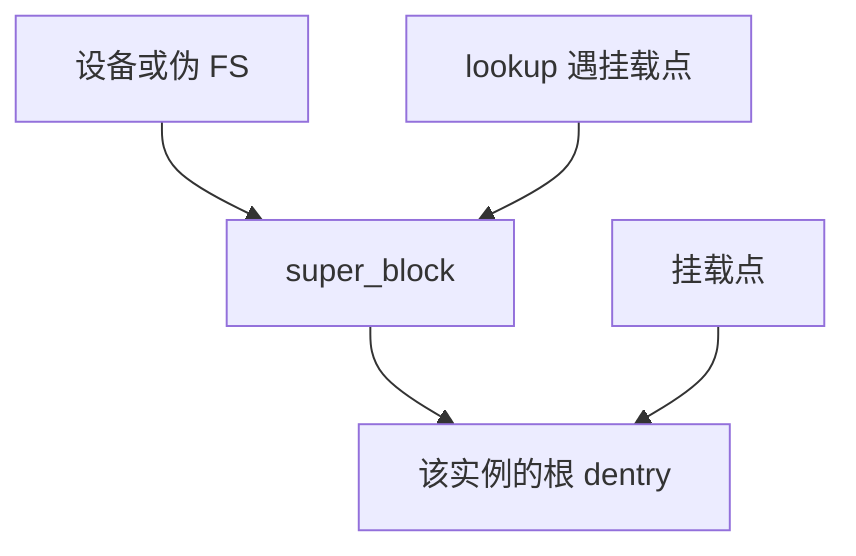

# 挂载与超级块

超级块描述一次已挂载的文件系统实例；挂载点把该实例的根接到目录树的某个 dentry 上。

<footer>—— 据 Kleiman 的 vnode；McKusick 对 BSD 挂载的整理；Linux VFS 文档</footer>

[上一课](/cs/vfs)给出操作表，底下可以是不同 FS。[路径查找](/cs/path-lookup)会碰到「换超级块」的接口。[inode](/cs/inode-dir) 号只在一台已挂载实例内有意义。缺口是**挂载**：设备、类型、根 inode、选项，以及用户看见的单棵树如何由多棵拼成。

## 问题

若全局只有一棵磁盘上的树，U 盘与 NFS 无法接到 `/mnt`。若每个 FS 自己实现整条 `open` 路径，VFS 白做。缺口：`mount` 读设备上的超级块（魔数、块大小、根 inode），在内核创建 `super_block`，把某目录变成挂载点——lookup 走到该 dentry 时切换 super，从客 FS 的根继续。卸载要保证无忙 inode，并写回脏元数据。

本课不把绑定挂载与命名空间的容器语义写完，那是隔离课。

同一设备可只读挂、可挂多次（实现相关）。proc、sysfs 没有块设备，超级块仍存在，只是内存里造出来。

## 方法

`mount(source, target, fstype, flags, data)`：VFS 调该类型的 `fill_super`，建立根 dentry。后续 [dcache](/cs/dcache) 在挂载点上有「越过」逻辑。`umount` 检查引用。根文件系统在启动时由 init 指定，后课 early-boot 再接。用户路径仍从进程 root 开始，不感知设备号。

## 机制

超级块把「哪一种 FS、哪一份数据」变成内核对象，VFS 操作表有了 `this` 指针。崩溃一致性后课要写回的正是这份 super 与其 inode。不要把挂载写成包管理器或容器镜像教程；对象只是树的拼接。块如何进内存，缓冲课已经在下一课等着。

与[用户/内核分裂](/cs/user-kernel-split)无关：挂载是命名空间里的树，不是虚地址。

## 边界

本课不引入 loop 设备加密的全部栈。不保证所有 FS 支持在线 resize。下一课缓冲与脏页会假定：已有一块已挂载实例，读写落到块号。

后课默认：目录树可由多个 super 拼成。块在内存中的 Cache 与脏位，下一课缓冲与脏页。

## 小结

- super_block 是一次挂载实例；挂载点切换查找。
- 伪文件系统同样有超级块，只是无磁盘。
- 脏缓冲与写回是下一课。
- 出处：Kleiman, 1986；McKusick et al., *4.4BSD*；Linux VFS。
