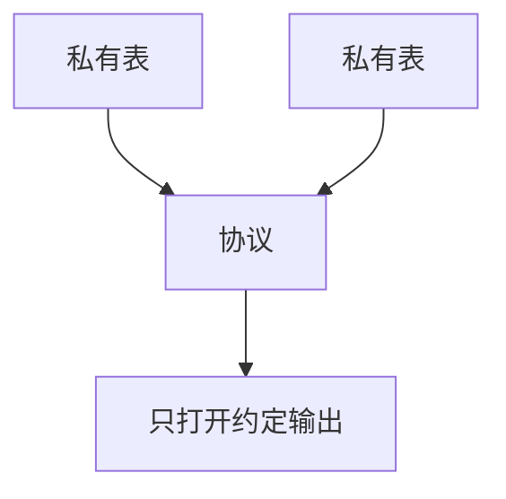

# MPC 应用

多方计算让机构在不交出明文表的前提下算交集或统计。应用落点是反洗钱式的集合交集、联合分析；成本在通信轮次与恶意模型。

<footer>—— 据 Yao；PSI 工程实践点名；对照[门限与 MPC 直觉](/cs/threshold-mpc)</footer>

## 定位

上一课[令牌化](/cs/data-masking-tokenization)仍有保险库明文。缺口是**计算时也不集中表**。密码学单元已有 MPC 直觉；本课应用与限制。

后课默认已经读完本课钉下的合同，只补差，不从该领域第一性原理重开。

## 问题

两家银行要比对客户重叠。明文交换违法或违约。PSI/MPC。缺口是：诚实多数假设、性能、谁看到输出。

### 输出仍可能漏

交集本身是信息。DP 可叠在输出上。

Yao；PSI 文献。PIR 下一课是检索隐私。

## 方法

对照令牌化中心。列出联合统计、PSI。下一课 PIR。

图中节点是本课的机制骨架；课程不把图展开成可运行的攻击步骤。

## 机制

治理上的数据不出域。PIR 下一课是用户对数据库的隐私查询。

前提写进合同之后，游戏外的误用只当失败模式点名，不在本课写成操作程序。

## 边界

不写部署到量化交易。PIR 下一课。

## 小结

- 令牌化仍有库；MPC 让计算分散。
- 输出策略与模型假设决定泄漏。
- 应用是交集与统计，不是万能。
- 下一课 PIR。
- 出处：Yao；对照 [threshold-mpc](/cs/threshold-mpc)。
