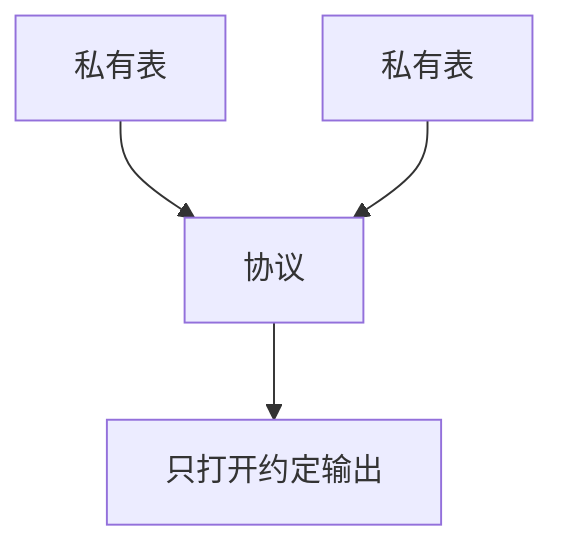
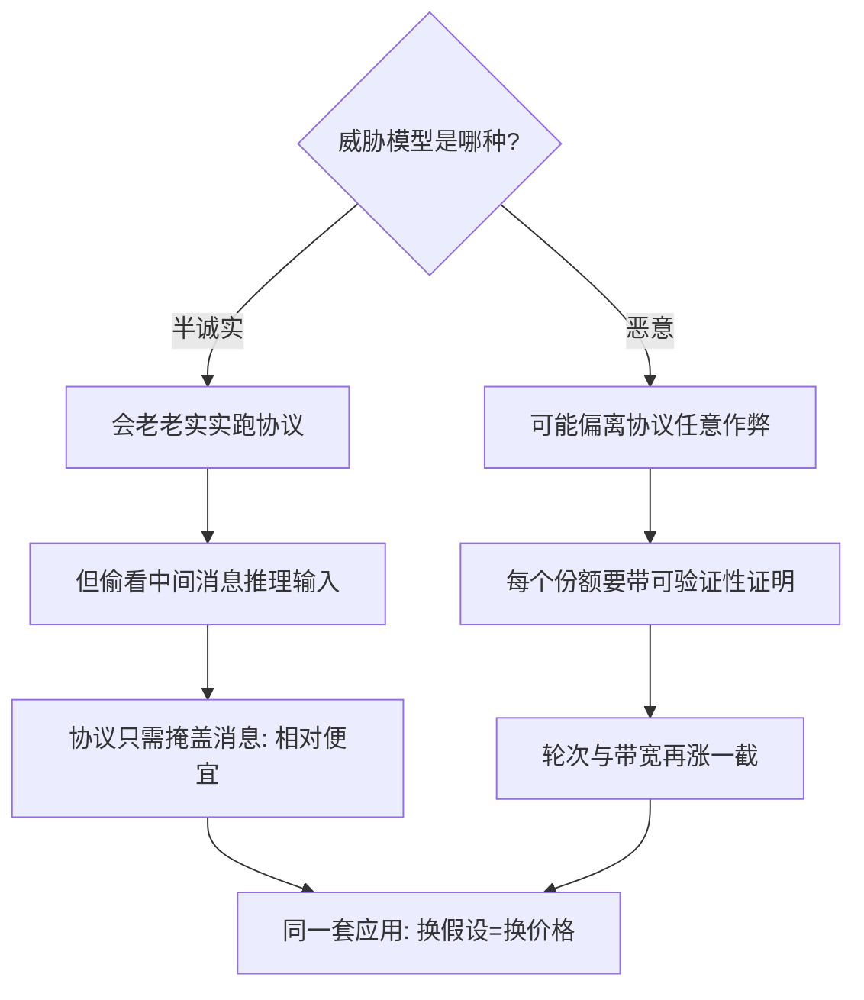

# MPC 应用

多方计算让机构在不交出明文表的前提下算交集或统计。应用落点是反洗钱式的集合交集、联合分析；成本在通信轮次与恶意模型。

<footer>—— 据 Yao；PSI 工程实践点名；对照[门限与 MPC 直觉](/cs/threshold-mpc)</footer>

上一课[令牌化](/cs/data-masking-tokenization)仍有保险库存明文；缺口是更进一步——**计算时也不把表集中到任何一方**。密码学单元已讲过 MPC 直觉；本课收应用与限制。

后课默认已经读完本课钉下的合同，只补差，不从该领域第一性原理重开。

## 问题

两家银行想比对客户重叠、几家机构想做联合统计，但明文交换违法或违约。PSI（隐私集合求交）与 MPC 让协议在密文份额上运算，最后只打开约定的输出。缺口是三件：多数协议只假设半诚实而非任意叛徒、性能比明文慢几个数量级、以及输出本身会泄漏。

PSI（隐私集合求交）就是「双方各自拿着一份名单，算出共同部分，且谁也看不到对方名单上不在交集里的名字」。它是 MPC 思想收窄到一个具体函数的量产版——函数越具体，协议越能压到工程可用。

### 输出仍可能漏

输出仍可能漏：交集本身是信息——「某人同时在两家名单里」常常就是结论。要压这个泄漏，可以在输出上再叠差分隐私噪声。

为什么「只输出交集」也可能闯祸：如果 B 银行的名单只有三个人，那么「你的客户张三与我们有交集」这句话等于泄露了 B 名单的三分之一内容。交集越小、越结构化，单条输出携带的关于输入的信息就越多——协议保密不等于结论保密。

Yao；PSI 文献。PIR 下一课是检索隐私。

## 方法

方法先对照令牌化的中心化保险库：令牌化把明文锁进一家，MPC 干脆让明文不出现。应用清单按成熟度排：PSI 已是反洗钱与通讯录发现里的量产技术；联合统计（均值、直方图）次之；通用两方计算仍然贵。下一课 PIR。

```mermaid
flowchart TD
  A["私有表"] --> MPC["协议"]
  B["私有表"] --> MPC
  MPC --> Y["只打开约定输出"]
```

## 机制

机制落点是治理语义变了：「数据不出域」从管理承诺变成协议性质——各方只学到函数输出，学不到对方输入的其余部分，审计对象从数据流转变成协议与实现的正确性。代价同样实在：通信轮次随电路深度增长，换成恶意模型还要给每个份额加可验证性，开销再涨一截。PIR 下一课是用户对数据库的隐私查询。

```mermaid
flowchart TD
  M{"威胁模型是哪种?"}
  M -->|"半诚实"| SH["会老老实实跑协议"]
  SH --> SH2["但偷看中间消息推理输入"]
  SH2 --> SH3["协议只需掩盖消息: 相对便宜"]
  M -->|"恶意"| MA["可能偏离协议任意作弊"]
  MA --> MA2["每个份额要带可验证性证明"]
  MA2 --> MA3["轮次与带宽再涨一截"]
  SH3 --> OUT["同一套应用: 换假设=换价格"]
  MA3 --> OUT
```

半诚实（semi-honest）对手的准确定位是「好奇但守规矩」：它严格按协议执行、一步不偏离，只是把过程中看到的消息全部记下来尝试反推输入。恶意（malicious）对手则连规矩都不守，所以协议必须自带「抓作弊」的证据机制——贵就贵在这里。

## 边界

不把 MPC 写成量化交易的部署方案；边界要点名：参与方串通超过阈值、输入长度这类元数据侧信道、协议实现错误，都不被理论安全覆盖。PIR 下一课。

## 小结

- 令牌化仍有库；MPC 让计算分散。
- 输出策略与模型假设决定泄漏。
- 应用是交集与统计，不是万能。
- 下一课 PIR。
- 出处：Yao；对照 [threshold-mpc](/cs/threshold-mpc)。
