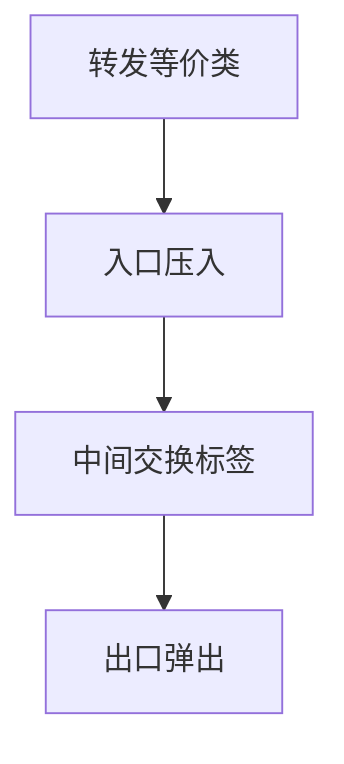

# MPLS

入口把前缀或流量类映射成标签，中间只交换标签；把 TE 与 VPN 从「每跳最长前缀」里解放出来。

<footer>—— 据 RFC 3031 MPLS 架构；RFC 5036 LDP；RFC 3209 RSVP-TE 整理</footer>

[上一课](/cs/traffic-engineering) 要显式路径。缺口是**数据面怎么走显式路径而不改 IP 头**：MPLS 标签栈、LDP 与 RSVP-TE。本课不把段路由 SID 写完。

## 问题

IP 每跳 LPM，路径随 IGP 变。MPLS：ingress 压入标签，transit 查 ILM 换标签，egress 弹出。PHP 可在倒数第二跳弹出。TE LSP 用 RSVP 预留带宽；LDP 跟 IGP 拓扑走，不单独 TE。VPN（后课对照 EVPN）用两层标签：外层走隧道，内层选 VRF。

不要把标签当成 MAC：标签是本跳局部的，MAC 是接口烧录或学习来的。

RFC 3031。标签 20 比特。流量工程与 VPN 是 MPLS 的两大理由，不是「比 IP 更快的查找」神话——TCAM 后课会说 IP 也能线速。

### 标签是局部 FEC

中间不查用户 IP。LDP 跟随 IGP，RSVP-TE 带带宽。VPN 常用两层标签。更快查找不是引入 MPLS 的理由。

## 方法

画：IP 包 → 压标签 → 交换 → 弹标签 → IP。对照 VLAN：VLAN 是广播域着色，MPLS 是转发等价类。与 GRE 后课对照：GRE 是 IP-in-IP 风格隧道，中间仍 LPM。

方法止于选定对象与对照；机制才说它如何嵌入已有分层与主干课。

## 机制

BGP 下一跳可达可变成「到下一跳的 LSP」，加速收敛（PIC）是工程。IXP 上通常仍是 IP 对等，MPLS 多在 AS 内。PFC 可在 MPLS 以太网上按 TC 映射，与有线课衔接。

失败：LSP 断了要 make-before-break 或 IGP 绕路，否则黑洞，像 RR 藏备选。

## 边界

本课不引入 GMPLS 光层。分段路由是下一课。后课默认：MPLS 用标签换路径与 VPN 上下文；中间不查 IP。

「MPLS 已死」口号忽略大量运营商 VPN；SR 是演化不是瞬间替换。

上一课留下的缺口在本课收口；「MPLS」进入后课词汇表后只引用。文献用来钉对象与边界，不把本课写成该主题的独立综述。下一课[分段路由](/cs/segment-routing)。

## 小结

- 标签转发实现 FEC 与显式路径。
- LDP 跟随 IGP；RSVP-TE 做带宽 LSP。
- 中间跳不必 LPM 该用户 IP。
- 后课只引用本课钉死的对象，不从该领域总问题重开。
- 出处：RFC 3031；RFC 3209；RFC 5036。
