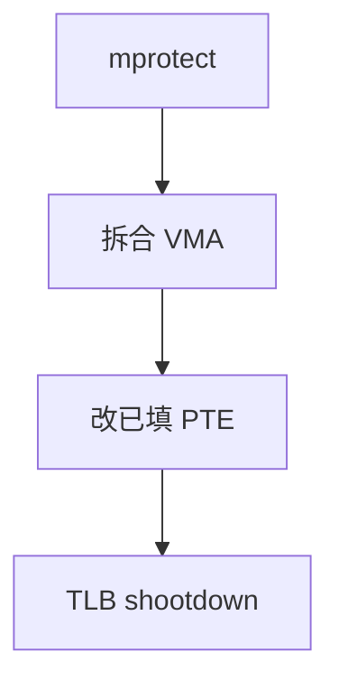

# mprotect

已存在的虚区间可以改权限：读、写、执行的组合变了，页表项与 TLB 必须跟着变。

<footer>—— 据 POSIX mprotect；Silberschatz 对保护域的整理</footer>

[上一课](/cs/mmap)已经能把文件或匿名页接到 VMA。[分页](/cs/paging-vm)的权限位在缺页时检查。[用户/内核分裂](/cs/user-kernel-split)禁止用户给内核页加写。缺口是运行中**改自己的用户页权限**：JIT 要先写后执行，栈要 NX，调试器要临时可写。不是新的映射，是改已有映射。

## 问题

若只能在 mmap 时定权限，代码生成器必须unmap 再 map，丢失内容或窗口不安全。`mprotect` 按页对齐改一段 VA 的 r/w/x。缺口：拆 VMA、改 PTE、[TLB shootdown](/cs/tlb-shootdown)。把可写改成不可写可能触发后课 COW 已处理的逻辑；把不可执行改成可执行要受安全策略约束——本课只要求内核拒绝无意义组合，不讲攻击步骤。

本课不把 `pkey` 与内存保护键的全部 ISA 写完。

`madvise` 提示内核预读或可丢页，不改权限。`mincore` 查询哪些页在内存。本课合并：它们操作同一段 VMA，对象仍是区间，不是新的页表格式。

## 方法

用户给出区间与新 prot。内核按页对齐，必要时把原 VMA 劈成三段，中间段新权限。已存在的页改 PTE；未分配的页只改 VMA，下次[缺页路径](/cs/page-fault-path)按新权限填。他核 TLB 必须 shootdown，否则仍按旧写位存储。失败返回 EACCES/ENOMEM，不留下半改的权限。

## 机制

mprotect 让保护变成动态的：同一物理页在不同时刻对同一进程可写或不可写。这与文件模式位不同——那是后课 inode 上的 rwx，对象是文件；这里是虚存。W^X 策略（写与执行不同时）由用户或安全模块在调用时拒绝，不是 MMU 新周期。

不要重导页表 walker。只改权限位与 VMA 标志。

## 边界

本课不引入 `userfaultfd` 与保护键的组合拳。不保证所有架构支持对文件共享映射随意加执行。区间必须页对齐；未对齐由内核上取整或报错，POSIX 有规定。下一课离开用户 VMA，问内核自己的物理页从哪来。

后课默认：用户可改已有映射的权限。内核分配 2^n 页块给页表与缓冲，下一课 buddy。

## 小结

- mprotect 改 VMA 与 PTE 权限，并 shootdown。
- 未触碰的页只改区间描述，缺页时再生效。
- 内核页框分配器是 buddy 的缺口。
- 出处：POSIX.1 `mprotect`；Silberschatz et al., *OSC*；Love, *LKD*。
