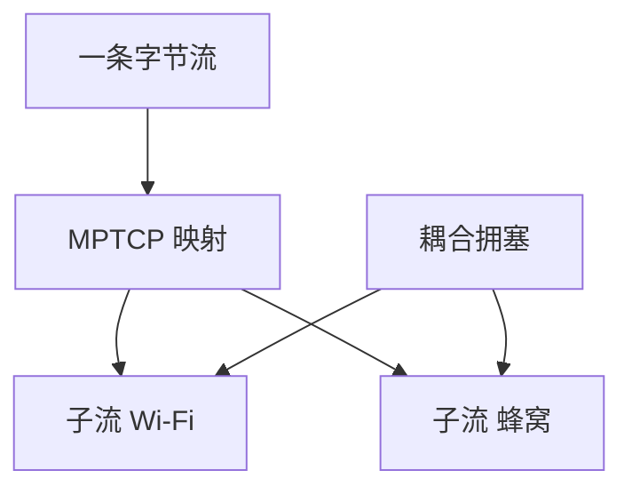

# MPTCP

一条逻辑 TCP 绑多条子流，各走不同地址或路径；应用仍看见一条字节流，调度在子流间搬数据。

<footer>—— 据 RFC 8684 MPTCP；Raiciu et al., SIGCOMM 2011 整理</footer>

[TSO](/cs/tso-lro) 结束单路径细节。主干仍是单四元组。[上一课](/cs/tso-lro) 不解决 Wi‑Fi+蜂窝同时用。缺口是 **MPTCP**：子流、令牌、耦合拥塞。本课不把 SCTP 写完。

## 问题

手机有 WLAN 与 LTE 两地址，单 TCP 只能钉一条。MPTCP：主子流握手后再 ADD_ADDR 开子流，DSS 映射到数据级序号。拥塞：若各子流独立 AIMD，会在共享瓶颈偷两份——要耦合（如 LIA）。中间盒若剥 MPTCP 选项则回退普通 TCP。与 LACP/ECMP：那些是跳内哈希；MPTCP 是端到端多路径。

不要把 MPTCP 写成 QUIC 迁移的拷贝，下一课对照。

RFC 8684。部署受 NAT 与 API 限制。本课不把每种调度器（minRTT 等）写完。

### 一条逻辑字节流

子流可走 Wi‑Fi 与蜂窝。拥塞要耦合，防共享瓶颈加倍。中间剥选项则回退 TCP。ADD_ADDR 要令牌。

## 方法

画：应用套接字 → 逻辑连接 → 子流 A/B。对照 SCTP 多宿：SCTP 是另一协议，MPTCP 兼容 TCP 应用。

方法止于选定对象与对照；机制才说它如何嵌入已有分层与主干课。

## 机制

BDP 是各子流之和，窗口缩放每子流协商。RPKI 与路径无关。半开保活要每子流或逻辑层。数据中心 ECMP 已多路径，MPTCP 再开可能过度。无线 TCP 后课的误码在子流间可避开坏口。

安全：ADD_ADDR 要令牌，防劫持子流。

## 边界

本课不引入 MP-QUIC 的全部。SCTP 对照是下一课。后课默认：MPTCP 把多径对应用隐藏为一条 TCP。

内核/库未开则应用无感也无益。

上一课留下的缺口在本课收口；「MPTCP」进入后课词汇表后只引用。文献用来钉对象与边界，不把本课写成该主题的独立综述。下一课[SCTP 对照](/cs/sctp)。

## 小结

- 多子流一条逻辑字节流。
- 拥塞要耦合，防共享瓶颈加倍。
- 中间盒可能迫使回退。
- 后课只引用本课钉死的对象，不从该领域总问题重开。
- 出处：RFC 8684；Raiciu et al., 2011。
