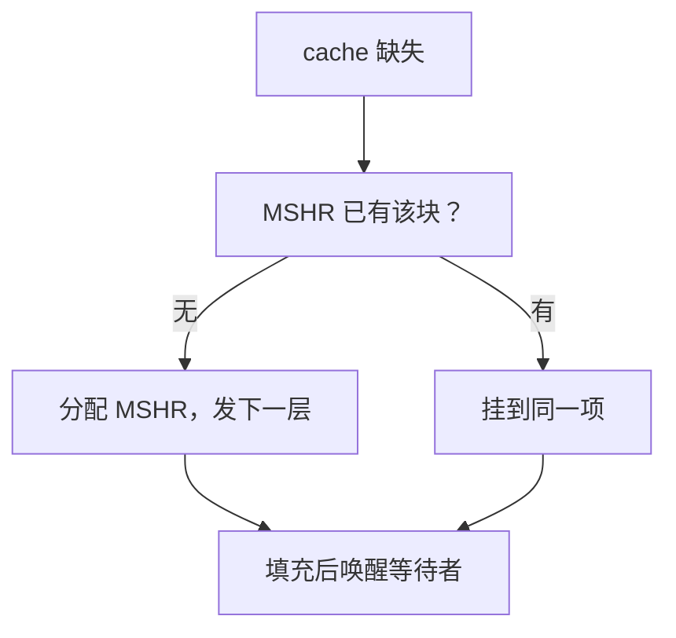

# MSHR 与缺失下继续

一次缺失不必堵住整条流水线：记下「谁在等这块」，后续命中与不相关缺失仍可走。

<footer>—— 据 Kroft, Lockup-Free Instruction Fetch/Prefetch Cache Organization, ISCA 1981；Hennessy and Patterson, CA:AQA 整理</footer>

[上一课](/cs/cache-miss-types)把缺失分成强制、容量、冲突，并假定缺失期间核在等。五级 MEM 一拍完成是教学假设；DRAM 要许多拍。[IPC 与利用率](/cs/ipc-util)已经对空转过敏。本课不重讲三分法。缺口是：阻塞 cache 让一次缺失冻结所有访存；非阻塞 cache 用缺失状态处理寄存器（MSHR）把「已发出的块请求」与流水线解开。

## 问题

load 缺失若锁住 cache 端口，后面的命中 load、甚至不相关的缺失都不能发。乱序核窗口里常有多条独立 load。缺口不是更大的 cache，而是**为每个未完成的块分配一项：地址、已回到的扇区、等待该块的 load/store 名单**；填充完成再唤醒它们。

同一块上的第二次缺失不应再发一条 DRAM 事务：合并进已有 MSHR 项（secondary miss）。项用尽则仍要停，变成结构冒险。

Kroft 1981 的 lockup-free cache 是非阻塞设计的经典出处。MSHR 是后来教材用的名字。

## 方法

缺失：查 MSHR 是否已有该块。无则分配项，向下一层发请求，流水线可继续执行不依赖该 load 的指令（五级顺序核则仍可能在提交点等；乱序核用 ROB 托住）。有则把本请求挂到该项。填充：数据写入 SRAM，按名单转发，释放项。

预取也可以占 MSHR：提前发的块与需求缺失抢项。那是下一课的交易，本课只承认项是共享资源。

## 机制

非阻塞把「缺失率」和「缺失延迟对 IPC 的杀伤」拆开：同样缺失次数，能继续做的有用功不同。阿姆达尔：未掩盖的那一段缺失延迟仍封顶加速。MSHR 深度、到 DRAM 的未完成事务数、写缓冲，都是队列容量。

顺序五级若不允许缺失下继续，本课几乎退化成「MEM 级暂停」。对象仍要先建立，后课乱序才吃满它。

## 边界

本课不引入预取算法，不引入一致性下 MSHR 与探听的竞态（迟到的作废 vs 填充）。也不把 MSHR 当成 ISA。victim buffer 不是 MSHR：前者存刚踢的数据，后者存未完成的请求。

后课默认：cache 可以非阻塞；一次缺失不再默认冻结所有访存。主动把块请来是下一课预取。

## 小结

- MSHR 记下未完成块与等待者，允许缺失下继续。
- 同块二次缺失合并；项满则仍停。
- 预取与 MSHR 抢项，是下一课。
- 出处：Kroft, *ISCA*, 1981；Hennessy and Patterson, *CA:AQA* 非阻塞 cache。
