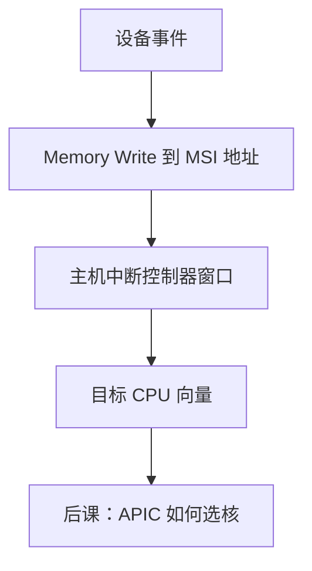

# MSI / MSI-X 中断

  
设备不再拉一根 INTx 线，而是写一个约定的内存地址：这条 Memory Write TLP 被主机构成中断，向量在消息数据里。

  <footer>—— 据 PCI-SIG PCI Express Base Specification；Intel 64 and IA-32 Architectures Software Developer’s Manual 整理</footer>

[上一课](/cs/pcie-tlp-bar)让设备能发 Memory Write。组成/OS 课的 [PLIC](/cs/plic-irq) 是线汇聚模型。缺口是 PCI **消息信号中断**：MSI 与 MSI-X 用写事务代替边沿/电平线，向量可以很多。

## 问题

传统 INTx 共享、电平、桥上虚拟线，扩展性差。MSI：配置能力里写 Message Address/Data，设备发一条写。MSI-X：独立表（常在 BAR）每向量各地址/数据，可掩码，向量数远大于 MSI。缺口不是 TLP 头格式重讲，而是：**中断=定向写**，与 DMA 写同类，只是地址落在中断控制器接收窗口（如 x86 的 FEE0_xxxx 或 IOMMU/APIC 区域）。

RISC-V 平台可用 MSI 接到 IMSIC 或经转换接到 PLIC，细节因平台而异，本课钉 PCI 侧合同。

### MSI 不是「更快的轮询」

没有消息时 CPU 不因该设备进中断；轮询是软件读门铃。把 MSI-X 理解成硬件自动 poll BAR，中断亲和与节能模型全错。过多向量浪费表项；过少则共享处理函数。

PCI-SIG 定义 MSI/MSI-X 能力结构。Intel SDM 描述本地 APIC 如何接收这些写。下一课 APIC 路由。Linux 驱动写 `pci_alloc_irq_vectors` 一类，本课不背 API。

## 方法

枚举时 OS 分配向量，编程 MSI-X 表，使能。设备事件：写对应表项的地址/数据。主机：APIC 投递到目标 CPU，软件在处理函数里读设备原因寄存器（仍经 BAR）。与 DMA 写序：描述符写完再发 MSI，通常靠 PCIe 的同路径 Posted 序或显式围栏——后课 DMA 再钉。

错误消息（AER）也走 Message TLP，不是 MSI 表，点名区分。

## 机制

下一课 APIC/IOAPIC/x2APIC 决定向量落到哪颗核，与 [irq affinity](/cs/irq-affinity) 软件策略衔接。本课只把 PCI 设备从「拉线」换成「写消息」。

## 边界

本课不写 IOMMU 中断重映射表的全部字段，不把虚拟 MSI 注入写成完整 VFIO 课。不讨论中断风暴的全部缓解。

后课默认：PCIe 设备用 MSI/MSI-X 写消息投递中断；向量在表里。

## 小结

- INTx 共享线被 MSI 写事务替代。
- MSI-X 每向量独立地址/数据，表在 BAR。
- 投递窗口由主机中断控制器定义。
- 出处：PCI-SIG PCIe Base Spec；Intel SDM。
