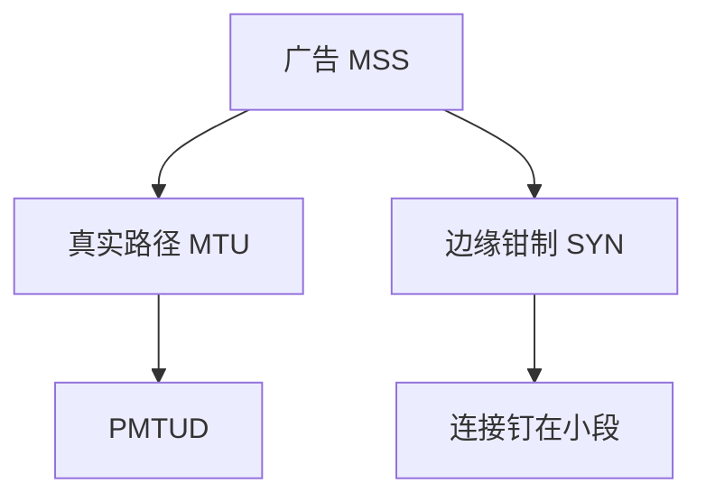

# MSS 与钳制

MSS 是对端愿意收的最大段；路径更小时应 PMTUD，边缘用钳制改 SYN 里的 MSS，是权宜，会把整条连接钉死在保守值。

<footer>—— 据 RFC 9293 TCP；RFC 6691 MSS 与 IP 选项；RFC 4821 对照整理</footer>

[PMTUD](/cs/pmtud) 与 [巨帧](/cs/jumbo-mtu) 已给路径最小。[上一课](/cs/window-scale-timestamps) 放大窗口。缺口是 **MSS 选项与 MSS clamping**：隧道口、PPPoE、VLAN 如何在 SYN 上减 40。本课不把 TCP 状态图画完。

## 问题

段太大则分片或黑洞。主机按本机 MTU 广告 MSS（IPv4 常 MTU−40）。中间看不到数据 MTU 时，用钳制把 SYN/SYN-ACK 的 MSS 改小，强迫两端用小段，避开 ICMP。代价：即使路径能 9000，连接仍 1460；TSO 后课会在网卡再切。IPv6 钳制同样存在。GRE/VXLAN 边缘最爱用。

不要把 MSS 写成 MTU：MSS 是 TCP 载荷，MTU 是 IP 包。

RFC 9293。钳制是运营技巧，不是 TCP 状态机一步。本课不鼓励在核心乱改包。

### MSS 不是 MTU

钳制改 SYN，避开黑洞也钉死段大小。优先统一 MTU 或真 PMTUD。乱钳到 536 会毁掉现代网。

## 方法

对照：PMTUD 动态 vs 钳制定静态。画：SYN MSS=9000 → 边缘改 1420 → 全程小段。与 BDP：小 MSS 使每 RTT 加一更细，但也更多头税。

方法止于选定对象与对照；机制才说它如何嵌入已有分层与主干课。

## 机制

快重传按段计；MSS 变，三个 dupACK 的字节数变。RoCE 用自己的 MTU，不借 MSS。QUIC 用 PMTUD/PLPMTUD 在 UDP 上。安全：钳制可被中间人用来降效，与 ICMP 缩小同类，需信任边缘。

数据中心统一 MTU 则少钳制。

## 边界

本课不引入 TCP 分段卸载的全部。TCP 状态机是下一课。后课默认：MSS 来自对端与路径；钳制是边缘补丁。

把 MSS 钳到 536「为了兼容」会毁掉现代网。

上一课留下的缺口在本课收口；「MSS 与钳制」进入后课词汇表后只引用。文献用来钉对象与边界，不把本课写成该主题的独立综述。下一课[TCP 状态机](/cs/tcp-state-machine)。

## 小结

- MSS 约束 TCP 段，关系是 MTU 减头。
- 钳制改 SYN，避开黑洞也钉死大小。
- 优先统一 MTU 或真 PMTUD。
- 后课只引用本课钉死的对象，不从该领域总问题重开。
- 出处：RFC 9293；RFC 4821。
