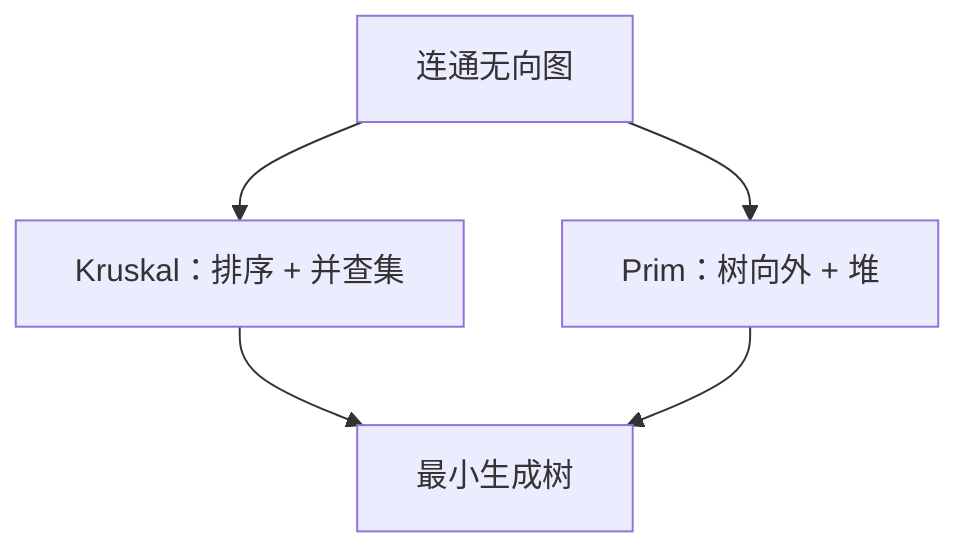

# Kruskal 与 Prim

连通无向图上，边权之和最小的生成树可以由安全边逐步长成：要么在森林间加最轻边，要么从一棵树向外长。

<footer>—— 据 Kruskal, On the Shortest Spanning Subtree, 1956；Prim, Shortest Connection Networks, 1957；CLRS 第 23 章整理</footer>

上一课[Johnson 全源](/cs/johnson-apsp)给了点对距离。最小生成树问的是另一件事：用 $|V|-1$ 条边连通、总权最小。本课不重做全源。缺口是：**安全边**——加进去不破坏某棵 MST 的前缀。[并查集](/cs/union-find)与堆已在。本课交出 Kruskal 与 Prim。

## 问题

无向连通、边权可比较（可负；负环不是 MST 的语言）。切分定理：对任意切分，横跨切分的最轻边是某 MST 的安全边。Kruskal：边按权排序，若两端不在同一连通块则加入（并查集）。Prim：从一棵树出发，反复加树到外部的最轻边（优先队列）。

与 Dijkstra 酷似但目标不同：Prim 的键是「到树的边权」，不是「到源的路权」。不要把 MST 当最短路树。

### 两种贪心同一套切分

Kruskal 的切分是当前森林的块；Prim 的切分是树内/树外。切分定理共用。正确性走贪心的安全边，一般贪心模板在[后课](/cs/greedy-correct)，本课先把 MST 做成实例。

Kruskal 1956、Prim 1957（Borůvka 1926 更早，本课点名第三算法但不实现）。并查集加路径压缩与按秩，Kruskal 几乎是 $O(E\log V)$ 排序主导。

## 方法

Kruskal：排序 $E$，对每条边 `Find` 两端，不同则 `Union` 并收录。Prim：类似 Dijkstra 的循环，松弛的是树外顶点到树的最小边权。

不连通则生成森林。本课默认连通。

## 机制

稀疏图 Kruskal 常更干净（排序一次）。稠密 Prim 用邻接矩阵扫描可 $O(V^2)$。唯一性：边权互异则 MST 唯一；否则可以多棵，算法给出其中一棵。最大生成树把权取负即可，仍是本课。

与最短路：负权对 MST 无妨（无向且不走环累加定义）。Dijkstra 仍要非负。

## 边界

本课不处理有向图的最小树形图（Edmonds/Chu–Liu）。不写度约束、Steiner 树——那些或 NP 或另一模型。后课最大流换成容量与割，不是生成树。

后课默认：MST = Kruskal 或 Prim；切分定理保证贪心安全。流网络是下一缺口。

## 小结

- 切分上的最轻边安全；Kruskal 并查集，Prim 长树。
- 稀疏常 Kruskal $O(E\log V)$；稠密 Prim $O(V^2)$。
- MST 不是最短路树；负权可接受。
- 出处：Kruskal, 1956；Prim, 1957；CLRS 第 23 章。
