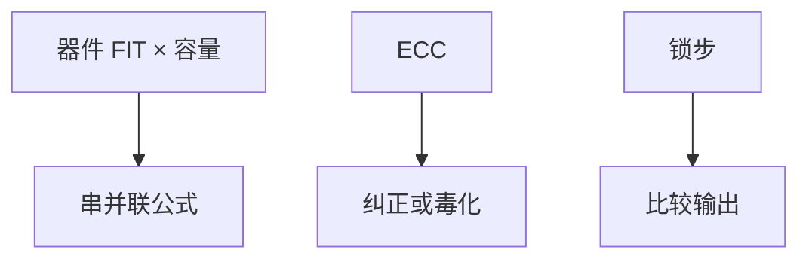

# MTTF 与冗余

软错误和老化让单颗 SRAM 单元不再「永远正确」；用 ECC、锁步、检错重试把故障变成可检测事件，平均无故障时间才回到可接受区。

<footer>—— 据 Hennessy and Patterson, CA:AQA 可靠性章；Siewiorek 等对容错计算的论述 整理</footer>

[上一课](/cs/gem5-simulation) 默认无故障。[DRAM 刷新](/cs/dram-refresh) 已暗示存储会丢电荷。本课不重讲模拟器统计。缺口是 **MTTF：故障率、串并联、以及微结构常用冗余（ECC、奇偶、锁步）。** 后课的 Rowhammer 是故障被诱导的特例，先把随机故障钉住。

## 问题

cache 与 PRF 的位翻转会让看起来精确的 [退休](/cs/retire-precise-exception) 写出错架构状态。服务器要求年故障率极低。缺口不是加一层预取，而是**用编码与重复换 MTTF**：检测则回滚到检查点或毒化行；纠正则对软件透明。

FIT（每十亿小时故障）累加：容量越大、电压越低，FIT 越高。ECC DIMM、L2/L3 ECC、寄存器奇偶是工业默认。锁步双核用于更高安全完整性。

## 方法

ECC：数据行加冗余位，纠正单比特、检测双比特（典型 SECDED）。奇偶：检测，不能纠正。锁步：两核跑同一指令流，分歧则错。检查点：与[推测恢复](/cs/speculation-recovery) 同源，但是架构级的定期快照。

## 机制

与性能：ECC 占带宽与延迟，Roofline 的 $B$ 略降。与安全：随机 FIT 不是 Spectre；Rowhammer 是主动打 FIT。本课只要求「微结构必须假设位会翻」。Amdahl 式的可用性：串行维护窗口同样限制。

检测后的策略：纠正则继续；不可纠正则毒化 cache 行或机器检查异常，精确性回到 [退休](/cs/retire-precise-exception)——故障要汇报到某条指令，不能让错误值提交。PRF 与 ROB 也需要保护，否则 ECC 只保护了内存。

## 边界

本课不把航空级形式化验证拉进来。Spectre 下一课从**正确预测路径上的微结构泄露**出发，不是 FIT。不要在本课写攻击步骤。

后课默认：随机故障靠 ECC/冗余。推测执行留下的缓存足迹是另一类「正确性」——架构对、微结构泄密。

## 小结

- MTTF 由 FIT 与冗余结构决定；ECC 是 cache/DRAM 的默认税。
- 锁步与检查点服务更高完整性。
- 推测执行的缓存副作用是下一课 Spectre。
- 出处：Hennessy and Patterson, *CA:AQA*；Siewiorek。
