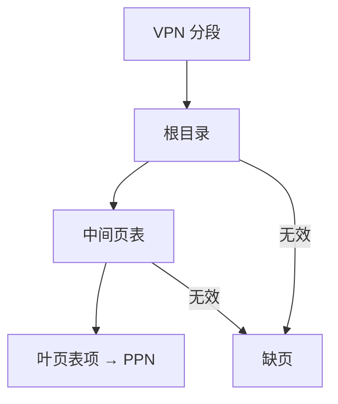

# 多级页表

单级页表按虚拟页号铺成一张大数组，空洞也占满物理内存；分级以后，空的那一段连中间页都不分配。

<footer>—— 据 Patterson and Hennessy, Computer Organization and Design (RISC-V)；Hennessy and Patterson, CA:AQA 整理</footer>

[上一课](/cs/tlb-translate)让常见翻译停在 TLB。TLB 缺失仍要查页表。[虚拟内存分页](/cs/tlb-translate)把页表写成 VPN 的数组：48 位虚拟地址、4 KiB 页时，单级表有两亿项，不能为每个进程各留一份连续物理数组。本课不重讲 TLB 命中路径。缺口是：页表自己的空间。本课只交出多级页表：VPN 切成几段，逐级索引。

## 问题

程序通常只用地址空间里几块（代码、堆、栈），中间是巨洞。单级表无法对洞不分配：数组下标必须覆盖整个 VPN。缺口不是更大的 TLB，而是**树：根物理页常驻，下一级页只在该段有映射时才存在**。

走访次数等于级数。TLB 缺失代价从「一次 DRAM 读」变成「三次或四次」。本课接受这笔费用，因为强制缺失相对进程寿命仍少。

RISC-V Sv39 三级、Sv48 四级是同一思想的参数。本课不绑死某一特权规范编号。

## 方法

把 VPN 分成 $k$ 段。第一段索引根目录，得到下一级表的 PPN；下一段再索引，直到叶页表项给出最终 PPN 与权限。任一级有效位为 0 即缺页，不必走到叶。

硬件走访或软件走访都按这棵树。TLB 填入的仍是叶结果：VPN 到最终 PPN，中间节点不必进 TLB。巨型页（把中间项标成直接映射一大块）是减少级数与 TLB 压力的附录，本课只点名存在。

## 机制

多级把页表容量变成与已映射页数成正比，而不是与虚拟空间成正比。代价是 TLB 缺失的多次访存，这些访存自己也走 cache，吃[局部性原理](/cs/locality-principle)。内核分配中间页失败与用户缺页不同，但都经精确异常路径。

页表页本身也有物理地址，可以再被 cache。一致性问题尚未针对多核：本课仍默认单核改页表后刷 TLB。

## 边界

本课不引入反置页表、不讨论分段与页混合的历史方案。也不把文件系统的目录树当成同一对象——只是「稀疏数组用树存」这一层相似。后课一致性会问：多核各自 TLB 与页表缓存如何作废。

后课默认：页表是多级的；TLB 命中仍一拍。谈到走表，允许若干次访存。

## 小结

- 单级表按虚拟空间铺开；多级只为有映射的段分配中间页。
- TLB 缺失代价随级数增加；叶项才进 TLB。
- 多核下各份副本如何一致，是下一课的缺口。
- 出处：Patterson and Hennessy, *COD* RISC-V；Hennessy and Patterson, *CA:AQA*。
