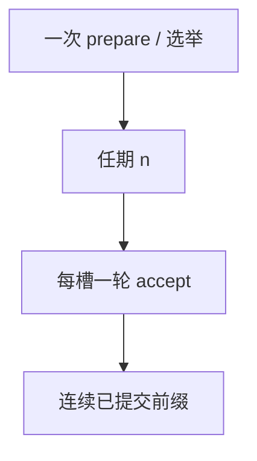

# Multi-Paxos

同一领导者把 prepare 摊到整个任期：每个日志槽只跑 accept。稳定主把两轮变成一轮，直到主被怀疑。

<footer>—— 据 Lamport, Paxos Made Simple, 2001；Chandra, Griesemer and Redstone, Paxos Made Live, PODC 2007 整理</footer>

上一课[Paxos](/cs/paxos)每个值两轮 RPC。RSM 每条命令都付两轮则延迟翻倍。缺口是**跨槽复用承诺**：领导者先对「我以编号 $n$ 统治后续槽」做一次 prepare，然后只对每个槽 accept。本课不重证相交。后课 Raft 用术语 term/log 把同一形状讲得更像实现。

## 问题

Basic Paxos 的 prepare 返回「该槽已接受值」。若领导者连任，空槽没有已接受值，prepare 只为占编号。把编号改成任期：一次 prepare（或选举）覆盖无穷槽，接受者为该任期承诺。之后客户端命令直接 accept 到槽 $i,i+1,\ldots$。

缺口：领导者不知道哪些槽已有空洞。Paxos Made Live：用状态机 + 日志压缩 + 磁盘、流控、以及「主必须把空洞填无操作」。活锁变成选举抖动。

Lamport 在 *Made Simple* 末节点出稳定领导者。Google Chubby 背后的 Paxos Made Live 把工程税写全：磁盘、多线程、问题成员。

## 方法

选举：想当主的节点用更高任期跑一遍 prepare 范围，收集各槽已有值，把自己日志对齐到「可能已选定」的前缀，再对外服务。接受：槽号 + 任期 + 命令。提交：多数派 accept 后可 apply——提交点是连续前缀，空洞不许跳着提交。

与主备：Multi-Paxos 的主是日志领导者，备是接受者；fencing 就是更高任期使旧 accept 被拒。这把[主备切换](/cs/primary-backup-failover)的纪元钉成 Paxos 编号。

## 机制

读优化：领导者若有租约（上一单元），可本地读，否则 read index 向多数派确认自己仍主。无租约时本地读不是线性一致。写延迟：连通且稳定主时一轮多数派 RTT。

成员尚未变：本课固定 $n$。配置变更是后课 Raft 更愿意讲的缺口，Paxos 用 α 配置或联合多数派，点名即可。

本课不把「Multi-Paxos」当成与 Basic 不同的安全理论：安全仍是每槽 Basic。工程差在日志、空洞、磁盘与主稳定性。

## 边界

本课不写 Raft 的选举超时公式，不引入 Zab 纪元。后课默认：生产用的 Paxos 是 Multi 形状；看到两轮 prepare/accept 是单槽或主不稳。Raft 下一课用更强的日志匹配规则降低实现歧义。

一轮 accept 是优化，不是新的不可能逃逸。主一抖，prepare 税回来。

## 小结

- 稳定领导者：每槽一轮 accept；prepare 按任期摊销。
- 提交必须是无空洞前缀。
- 旧主靠更高任期 fencing。
- 出处：Lamport, 2001；Chandra, Griesemer and Redstone, PODC 2007。
