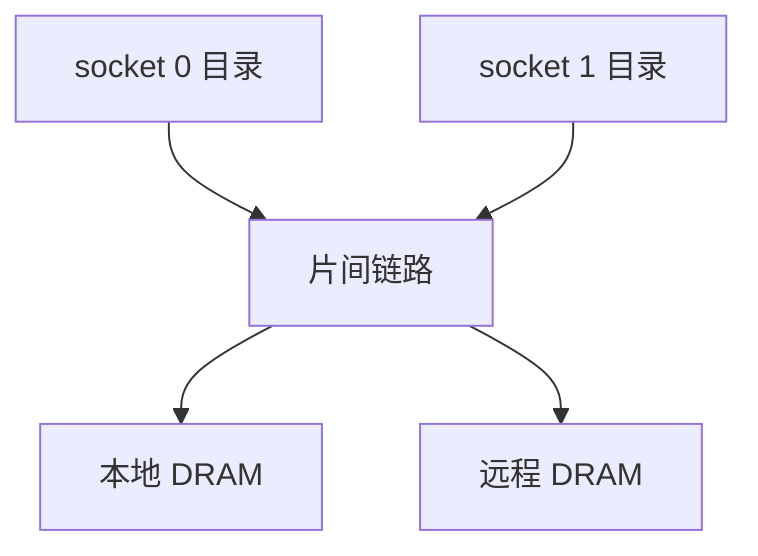

# 多路 socket 互连

两颗 CPU 各有自己的 LLC 与内存；目录要跨插座转发，延迟从片上几跳变成板级几十纳秒，NUMA 成为程序员可见的布局问题。

<footer>—— 据 Hennessy and Patterson, CA:AQA；Intel QPI/UPI 与 AMD Infinity Fabric 的公开描述 整理</footer>

[上一课](/cs/noc-routing-deadlock) 保证片上包不会死锁。服务器把多颗封装连在一起，每颗下面挂本地 DRAM。[目录](/cs/directory-scalability) 的 home 可能在另一颗芯片。本课不重讲 XY 路由。缺口是 **socket 互连：一致性域跨芯片，带宽与延迟不对称。**

## 问题

单 socket mesh 的 LLC 命中是几到十几 ns。跨 socket 读要经过互连控制器、物理层、对端目录，再可能到对端 DRAM。缺口不是再选一个 fat-tree 当片上图，而是**把远程 cache/内存当成另一层层次，并承认带宽远低于本地内存。**

UPI / Infinity Fabric：点对点链路，跑一致性与 I/O。链路条数决定对分。编程上就是 NUMA：线程与内存绑错则每记 miss 都付远程税。

## 方法

每 socket 一个或多个代理：把片上一致性事务翻译成片间包，维持 [MOESI/MESIF](/cs/moesi-mesif) 的全局不变式。远程命中：对端 LLC 或内存。广播在片间更贵，故更依赖目录。I/O 与加速器可挂在某一 socket，变成又一层不对称。

## 机制

[MLP](/cs/mlp-memory-parallelism) 仍能重叠远程 miss，但每条更长，需要更多 MSHR。[fence](/cs/fence-cost) 与锁的临界区跨 socket 时放大。OS [NUMA 调度](/cs/numa-sched) 是软件对策；本课只要求硬件提供不对称延迟。Gustafson 与扩展下一课开始从性能模型收口，不再加协议态。

目录 home 若总在远端，即使数据后来缓存在本地 L3，第一次仍要跨链路。地址交织与 homing 策略决定「哪些行永远远程」。编程上 first-touch 分配是在利用这一几何。

## 边界

本课不把 CXL 设备树写完。也不把多机 Infiniband 当同一课——那是机柜网络，一致性域通常不跨。并行加速比定律下一课。

后课默认：跨 socket 是 NUMA 一致性域。加速比该用哪条定律，先分清问题规模是否随机器涨。

## 小结

- 多 socket 把目录与内存变远程，NUMA 延迟进入每次 miss。
- 片间链路条数限制对分带宽。
- 加速比：Gustafson 与 Amdahl 的规模假设不同，下一课。
- 出处：Hennessy and Patterson, *CA:AQA*；QPI/UPI、Infinity Fabric 公开文档。
