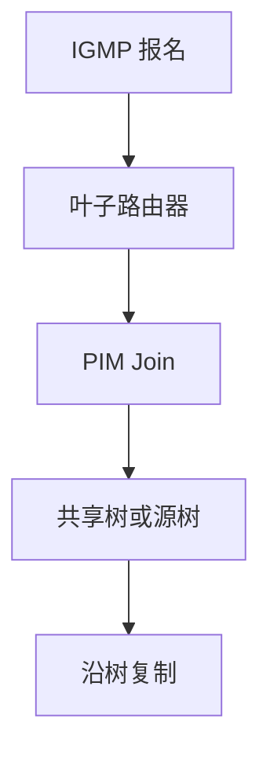

# 多播 IGMP / PIM

接收者用 IGMP/MLD 报名，路由器用 PIM 长树；数据沿树复制，而不是源发 N 份单播。

<footer>—— 据 RFC 3376 IGMPv3；RFC 7761 PIM-SM；RFC 4601 整理</footer>

[上一课](/cs/gre-tunnels) 默认单播。[EVPN](/cs/evpn) 的 BUM 需要复制。缺口是**IP 多播**：主机报告组，PIM 在路由器间建共享树或源树。本课不把 IPv6 过渡写完。

## 问题

直播、股票行情、某些覆盖 BUM：一对多。单播复制在源爆炸。IGMP 在最后一跳问「谁要 239.x」；窥探交换机把组播从泛洪收成端口集合，接住 MAC 学习课的组播痛点。PIM-SM：先加到 RP 共享树，再可切换最短源树。ASM vs SSM：有无显式源。

不要把多播写成 UDP 不可靠的替代可靠：仍无拥塞控制合同，要应用层或 FEC。

RFC 7761。RP 是共享树根，单点与策略对象。Bidir-PIM 等变体点名。本课不把 MSDP 写完。

### 树复制不是 N 份单播

IGMP 报名，PIM 建树，窥探收二层泛洪。无内置拥塞控制。跨域多播几乎萎缩。

## 方法

画：主机 IGMP → 叶子路由器 → PIM Join 向上 → 数据向下复制。对照生成树：STP 一棵无环二层树；PIM 按组/源多棵，且是三层。VXLAN 可用 PIM 做底层 BUM。

方法止于选定对象与对照；机制才说它如何嵌入已有分层与主干课。

## 机制

ECMP 与多播：RPF 检查要用到源的单播路由，哈希不当会导致 RPF 失败。TE 显式路径与多播树难叠加。RPKI 不管组播源伪造，需要 ACL 或 SSM。无线上多播常以最低 MCS 发送，吃容量。

状态：每组每源的树是软状态，规模是运营边界。

## 边界

本课不引入 PIM-SSM 的全部部署清单。IPv6 过渡技术是下一课。后课默认：IGMP 报名，PIM 建树，交换机可窥探。

互联网跨域多播几乎萎缩；域内与数据中心仍常见。

上一课留下的缺口在本课收口；「多播 IGMP / PIM」进入后课词汇表后只引用。文献用来钉对象与边界，不把本课写成该主题的独立综述。下一课[IPv6 过渡技术](/cs/ipv6-transition)。

## 小结

- 主机 IGMP，路由器 PIM，树复制。
- 窥探把二层组播从广播里收回。
- 无内置拥塞控制。
- 后课只引用本课钉死的对象，不从该领域总问题重开。
- 出处：RFC 3376；RFC 7761。
