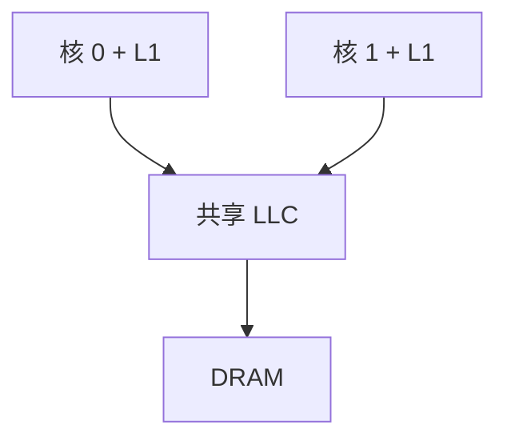

# 多核与共享缓存

每个核一套流水线与私有 cache，最后一层再共享；线程级并行不再挤在同一 ROB 里。

<footer>—— 据 Hennessy and Patterson, Computer Architecture: A Quantitative Approach 整理</footer>

[上一课](/cs/simd-vector)把规则数据收进一条指令。单核 ILP/DLP 仍受阿姆达尔未并行部分限制，且一块硅上再加宽发射的回报下降。[一致性问题引入](/cs/coherence-intro)已经警告多份 cache。[CPI 与阿姆达尔](/cs/cpi-amdahl)的对象仍是单处理器时间。本课不重讲 Tomasulo。缺口是：把多个程序计数器放到同一芯片上，用共享内存通信。本课只钉多核与共享末级缓存，协议状态留到 MESI。

## 问题

一个 ROB 窗口挖不出网页服务器那种任务级并行。复制整台机器则进程间只能走显式消息。缺口是**片上多个核，物理地址同一套，末级 cache 与 DRAM 共享**，从而负载/存储成为核间通信。

私有 L1 保留命中速度；共享 L2/L3 让核间传递 cache 行比绕到 DRAM 短。没有协议时，上一课引入的一致性问题变成默认情况。

SMT 是同一核多个线程共享执行单元，不是多核。本课先复制核。

## 方法

每个核：自己的流水线、TLB、L1。片上互连把核接到共享 LLC 与内存控制器。软件看见：线程跑在不同核上，同一虚拟映射（若共享地址空间）或各自页表。本课不写操作系统调度。

工作集在 LLC 命中时，核间共享只付片上延迟。私有 L1 仍写回，脏行必须在别的核读之前变成可见——机制是下一课 MESI。本课只要求：共享 LLC 不自动等于 L1 一致。两个核可以跑同一二进制的不同线程，页表可以共享，L1 仍然各持一份。

## 机制

并行加速比仍受阿姆达尔约束，现在 $f$ 是可分到多核的那部分。假共享：两个核写同一行的不同字，行在 L1 间弹跳，CPI 出现一致性缺失。布局课会再提；本课承认行是一致性粒度。

[局部性原理](/cs/locality-principle)变成每核一套工作集，外加共享结构的工作集。LLC 容量要同时装得下，否则容量缺失变成片外流量。

## 边界

本课不画总线事务，不定义 Invalid 与 Shared。不引入 NUMA：内存控制器暂时当作均匀的。存储序（是否允许 store 缓冲对别的核可见乱序）是一致性模型课，不是本课。

后课默认：片上有多个核、私有 L1、共享 LLC。读别人刚写的变量，必须先有一致性协议。

## 小结

- 多核复制 PC 与 L1，用共享内存和共享 LLC 通信。
- L1 副本使一致性成为常态，不是 DMA 特例。
- MESI 状态机是下一课的缺口。
- SMT 是同核多线程，本课先复制核。
- 出处：Hennessy and Patterson, *CA:AQA* 芯片多处理器。
