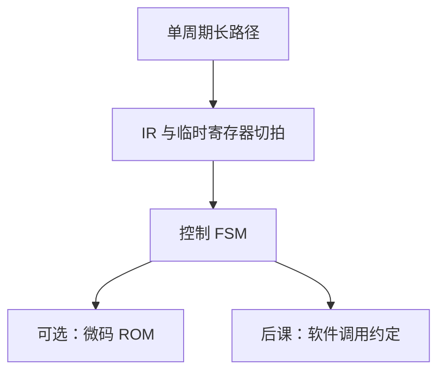
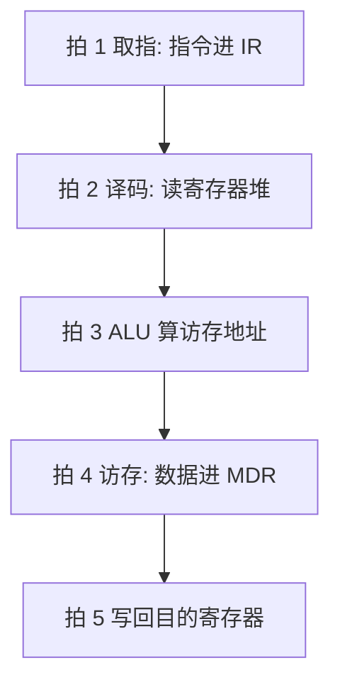

# 多周期与微程序直觉

把单周期的长组合切成若干拍，每拍共用一块 ALU 或存储器；控制器变成状态机，微程序只是把状态存在 ROM 里。

<footer>—— 据 Patterson and Hennessy, Computer Organization and Design (RISC-V)；Harris and Harris, Digital Design and Computer Architecture 整理</footer>

上一课[控制器真值表](/cs/control-truth-table)给出单周期组合控制。本课不重填那张表，也不从流水线转发另起。缺口是：单周期 $T$ 被 `lw` 拖死，`add` 却闲着。要把一条指令拆成**多拍**，每拍只走一段路径，时钟变快；CPI 大于 1，乘积可能更小。

## 问题

单周期里指令存储器与数据存储器、ALU 各用一次，但路径串联。缺口是插入临时寄存器（IR、MDR、A、B、ALUOut），让取指、译码/读堆、执行、访存、写回分拍，ALU 与存储器在不同拍复用同一硬件。控制成为[FSM](/cs/fsm-control)：现态「取指」转到「译码」再按 opcode 分支。

直觉类比：单周期像一位厨师配齐一整条流水台、从头做到尾，台面必须按最长的菜配；多周期像分五道工序、每道只占一段台面——做 `add` 这道快菜就不必陪 `lw` 慢慢等。

微程序：把 FSM 的下一态与控制向量存在控制存储器里，用微 PC 取微指令。直觉上仍是状态机，只是转移表在 ROM 不在门。RISC-V 整数核不必真用微码；复杂 ISA 才需要。本课要的是这层对应，不把历史 CISC 微码写成长综述。

### 多周期不是流水线

多周期同一时刻只执行一条指令的一个阶段。流水线多条指令叠在不同阶段，寄存器是流水寄存器，冒险另论。把 IR 当流水线 IF/ID，会提前偷体系结构课。

Patterson/Hennessy 的多周期章用明确状态：Fetch、Decode、Execute、Memory、Writeback。微程序是同一张图的 ROM 实现。Wilkes 的微程序概念作史注，不展开。

## 方法

列状态与每拍使能哪些寄存器、ALUSrc 接谁。`lw` 拍数多于 `add`。周期 $T$ 覆盖最慢的一拍（通常存储器）。平均 CPI 按指令混合加权。

数字实例：若五拍分别要 200、200、200、400、100 ps，多周期的 $T$ 只需覆盖最慢一拍 400 ps（再加寄存器开销），而不是单周期里五段串联的 1.1 ns——快的是时钟，慢下来的是 CPI。

```mermaid
flowchart TD
  SC["单周期长路径"] --> BRK["IR 与临时寄存器切拍"]
  BRK --> FSM["控制 FSM"]
  FSM --> UCODE["可选：微码 ROM"]
  FSM --> LATER["后课：软件调用约定"]
```

## 机制

硬件变少：一份 ALU、一份存储器口（若指令先锁进 IR）。性能：CPI×$T$ 与单周期 1×$T_{\mathrm{long}}$ 比较。后课流水线把 CPI 拉回近 1 同时保持短 $T$，代价是冒险。本课停在非重叠多拍。

```mermaid
flowchart TD
  IF["拍 1 取指: 指令进 IR"] --> ID["拍 2 译码: 读寄存器堆"]
  ID --> EX["拍 3 ALU 算访存地址"]
  EX --> MEM["拍 4 访存: 数据进 MDR"]
  MEM --> WB["拍 5 写回目的寄存器"]
```

常见误区：初学者容易以为多周期「做了优化所以更快」。其实它是 CPI 变大换 $T$ 变小；只有乘积 CPI×$T$ 更小才真的快——这正是它后来让位给流水线的原因。

异常可以在确定拍插入「保存 PC、转入口」状态，比单周期更好接——仍留到异常课。

## 边界

本课不实现流水、不讲超标量微码。不把 GPU 的 warp 调度当微程序。调用约定是软件层，下一课才讲，尽管 `jal` 已经能跳。

后课默认：多周期 CPU 是 FSM 控制器加数据通路寄存器；微程序 = 表驱动的 FSM。软件如何传参，下一课。

## 小结

- 多周期用状态寄存器把指令拆拍，复用 ALU/存储器。
- 控制是 FSM；微码是 FSM 的 ROM 形态。
- 与流水线不同：指令不重叠。
- 出处：Patterson and Hennessy, COD (RISC-V)；Harris and Harris。
