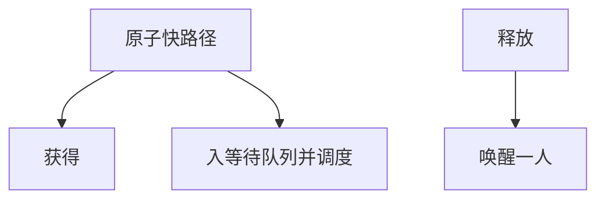

# mutex 与休眠

互斥锁在争用时把等待者挂到队列上并调度走；它有持有者概念，因而能做释放检查与优先级继承。

<footer>—— 据 Love, Linux Kernel Development；Silberschatz et al. 整理</footer>

[上一课](/cs/mcs-lock)把短等待做成可扩展自旋。临界区一旦可能等磁盘、或用户态可能被切走很久，忙等会烧光量子。缺口是 **mutex**：拿不到就睡眠，锁上记录持有者，释放时唤醒等待者。本课钉内核 mutex 与「禁在 IRQ 里拿」这条，不把 futex 系统调用写完。

## 问题

自旋假设持有者正在别的核上跑临界区，很快会放。若持有者已睡眠，或临界区很长，等待者应进入[运行队列](/cs/runqueue)之外的等待队列，让出 CPU。[锁与关中断](/cs/lock-irq) 已说 ISR 不能拿睡眠锁：没有可调度的「之后」。缺口是把睡眠互斥做成带所有者的对象，而不是裸信号量计数。

所有者让「释放非持有者」可查，也让 PI 知道该 boost 谁。信号量没有所有者，V 谁都能做。

## 方法

快速路径：原子把锁从空闲改为当前任务。慢路径：自旋一小会儿（可选），然后关队列锁、把自身挂入、`schedule`。释放：清所有者，唤醒一个等待者。嵌套：同类 mutex 通常不可重入，除非明确是 recursive——主干默认不可重入，以免假装释放。

与[内核抢占](/cs/kernel-preempt)：睡眠是自愿切换；持 mutex 时可以开抢占（与持自旋相反），但要防死锁与反转，PI 可叠加。

## 机制

mutex 把锁等待变成调度问题：等待者不算可运行，持有者能在没有自旋干扰下跑完（若没被更高级别挡住）。这改善吞吐，增加切换税。IRQ 与软中断仍禁止 `mutex_lock`。用户态 mutex 若每次争用都陷入，太重——下一课 futex 把未争用留在用户态。

## 边界

本课不把 `ww_mutex` wound-wait 写完，不讨论 RT 把自旋改成睡眠的全面替换。读写锁、seqlock 更后。死锁仍可能：两把 mutex 互等。

后课默认：内核线程上下文用 mutex 睡眠。用户态未争用锁应避免陷入，下一课 futex。

## 小结

- mutex：有所有者，争用则睡；禁止 IRQ 上下文。
- 持锁时可抢占，与自旋相反；可接 PI。
- 用户态快路径是 futex。
- 出处：Love, *LKD*；Silberschatz et al., *OSC*。
