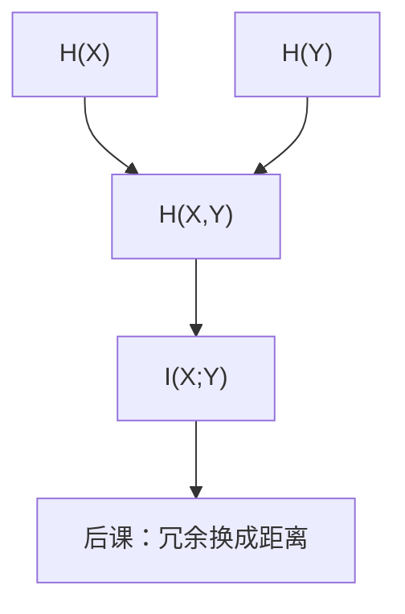

# 联合熵与互信息

$X$ 与 $Y$ 共享多少信息，等于单独两份熵减去合在一起还剩下的不确定度。

<footer>—— 据 Shannon, A Mathematical Theory of Communication, 1948 整理</footer>

上一课[信息量与熵](/cs/entropy-bits)钉死了自信息与 $H(X)$，并点名 $I(X;Y)=H(X)-H(X|Y)$ 与容量式子，当时不展开。本课不重推 $-\log p$，也不从信道框图另起综述。缺口是：**两个**随机变量怎么合在一张表上。没有联合熵，互信息只是一句定义，后课噪声信道没有「看见 $Y$ 之后 $X$ 还剩多少不确定」。

## 问题

$H(X)$ 管一个源。存储、总线、后课纠错，都是「发出 $X$、收到 $Y$」。缺口因此不是更大的字母表，而是联合分布 $p(x,y)$ 上的 $H(X,Y)$，以及链式法则 $H(X,Y)=H(X)+H(Y|X)$。互信息

$$
I(X;Y)=H(X)+H(Y)-H(X,Y)=H(X)-H(X|Y)
$$

对称，非负，当且仅当 $X\perp Y$ 时为零。上一课的「压缩下界」现在有了对照：相关的两路可以合起来压，独立则熵相加。

本课不证明 Shannon 第二定理，不把 $C=\max I(X;Y)$ 写成存在性论证。那是附录与信息论课，不插入主干。

### 互信息不是「相关系数」

相关可以是非线性的：$I$ 为零才叫独立（在有限字母表上）。只看 $\mathrm{Cov}$ 会漏异或一类依赖。也不把 $I(X;Y)$ 当成语义上的「有用程度」：Shannon 不管意思。

Shannon 1948 用联合熵与条件熵写信道。维恩图式的 $H(X)$、$H(Y)$、$I(X;Y)$ 是教学像，严格对象仍是联合分布上的和式。第一课的比特是符号位置；这里的比特仍是上一课的平均不确定度。

## 方法

有限 $\mathcal{X},\mathcal{Y}$，$p(x,y)>0$ 的项才进对数。$H(Y|X)=\sum_x p(x)H(Y|X=x)$。数据处理不等式点到为止：加工 $Y$ 不能增加关于 $X$ 的互信息——后课特征与哈希若当「无损」，须另证可逆。

离散概率公理仍在[更后的课](/cs/discrete-probability)才补全；本课继续用有限支撑上的 $p$ 与期望。

## 机制

有了 $I(X;Y)$，噪声被写成「信道」：$Y$ 是 $X$ 的污染版本，$I$ 给出平均还剩多少可分辨。下一课纠错不从熵再起，而从码字几何起：熵管速率下界，距离管最坏翻转。两套尺子从此分叉，本课只把联合这一侧钉死。

## 边界

本课不引入连续互信息、KL 散度全文、也不把大模型栏的注意力权重解释成 $I$。马尔可夫链 $X\to Y\to Z$ 的数据处理只当一句话。

后课默认：谈到两路符号的共享信息，用 $I(X;Y)$；独立则互信息为零。检错要另加几何。

## 小结

- 联合熵满足链式法则；互信息是对称的共享不确定度。
- $I=0$ 当且仅当独立（有限字母表）。
- 压缩下界仍是熵；信道用互信息，纠错用距离，下一课换尺子。
- 出处：Shannon, *A Mathematical Theory of Communication*, 1948。
