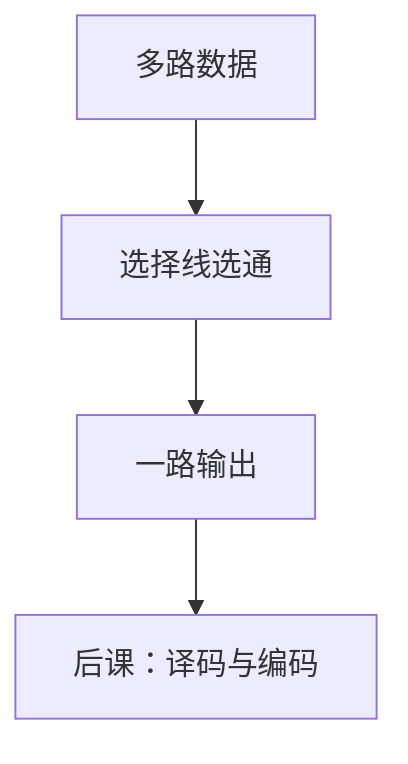

# 多路选择器

选择线指出哪一路数据应当出现在输出；数据通路上的「如果」多数先做成这个块。

<footer>—— 据 Harris and Harris, Digital Design and Computer Architecture；Patterson and Hennessy, Computer Organization and Design (RISC-V) 整理</footer>

上一课[关键路径](/cs/critical-path)给门网贴了 $t_{pd}$。本课不重算关键路径公式，也不从布尔最小项再展开一张总表。缺口是：后课 ALU、寄存器堆读口、单周期数据通路，反复出现「在 $2^k$ 路数据里挑 1 路」。需要一个有名字的组合块：**多路选择器**。

## 问题

最小项可以写「$s=00$ 则出 $d_0$，$\ldots$」，但每次从卡诺图做起太慢。缺口是固定模块：数据输入 $d_0,\ldots,d_{2^k-1}$，选择 $s$ 为 $k$ 位，输出 $y=d_s$。功能是一个 $k$ 位译码再与数据相与后或起来——与[译码器](/cs/decoder-encoder)共享结构，本课先钉 MUX。

CMOS 可用传输管或门级实现。延迟随 $k$ 增加：树形 MUX 深度 $O(k)$。本课用单位延迟直觉，不画晶体管。

### MUX 不是时序「选通脉冲」

选择线与数据一样是电平。没有时钟，输出跟着输入组合变。把 MUX 当成采样保持，会与后课锁存混名。使能端只是多一个「强制某常数」的数据输入或输出与门。

Harris 把 2:1、4:1 当积木。Patterson/Hennessy 的单周期图里 ALUSrc、MemtoReg 都是 MUX。本课不把那些控制信号提前译码。

## 方法

$2^k$:1 MUX 的布尔式 $y=\sum_i m_i(s)\cdot d_i$，其中 $m_i$ 是 $s$ 的最小项。宽数据则按位复制同一套选择。级联：两个 2:1 拼 4:1，延迟相加。

## 机制

数据通路把「指令选立即数还是寄存器」做成 MUX，控制端来自后课控制器。延迟计入关键路径：MemtoReg 往往在访存之后，成为单周期周期的一部分。本课只提供块；谁驱动 $s$，要等控制真值表。

MUX 也可以实现任意组合函数：把数据端接常量 0/1，选择端接变量，即真值表——这是延迟与面积通常很差的实现，LUT 的前身直觉，本课不展开 FPGA。

## 边界

本课不讲模拟多路开关的导通电阻、不把时钟门控当成 MUX。优先级编码器、译码器下一课才分开。总线争用（多驱动）不是 MUX；MUX 只有一个输出驱动者。

后课默认：数据通路上的选择是组合 MUX，延迟按选择树计入 $t_{pd}$。

## 小结

- MUX 用选择线挑一路数据；是组合块，不是锁存。
- 布尔上是最小项与数据相与再或。
- 后课 CPU 图里的选择信号都接本课这种块。
- 出处：Harris and Harris；Patterson and Hennessy, COD (RISC-V)。
