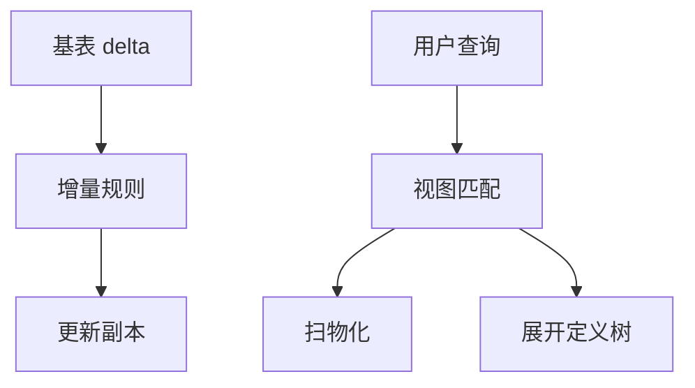

# 物化视图刷新

物化视图是带定义查询的副本；刷新把基表增量翻译成副本增量，否则读到的是过期快照。

<footer>—— 据 Gupta and Mumick 物化视图维护；Blakeley et al.；主干视图课的维护补全</footer>

[上一课](/cs/index-selection)把索引当访问路径。本课不枚举 INCLUDE 列。缺口是另一类物理设计：主干 [视图与物化](/cs/views-materialize) 已区分虚实，并点名增量维护；进阶要把**刷新时机与正确性**写清，优化器才能把视图匹配当合法改写。

## 问题

基表插入 $\Delta R$。若视图是 $R \bowtie S$，增量大致 $\Delta R \bowtie S$ 再并入副本（删除对称）。聚合视图要按组维护计数与合计，组计数到零则删行。缺口是：立即刷新（语句内，只读看见新结果）vs 延迟（提交后或按需）vs 全量重建。立即与事务隔离绑定；延迟则读者要接受陈旧或锁住刷新。

不可增量的定义（非单调、某些外连接、窗口）只能重建。优化器匹配：当前查询是否可被某视图覆盖（含补偿谓词）。匹配失败则当虚视图展开。

Gupta and Mumick 的维护综述。Blakeley, Larson, Tompa 对增量。本课不把每个代数算子的 delta 规则默写完，只锁定：维护必须与定义树同指称。

## 方法

增量：维护计划本身也是查询，走同一执行引擎。日志：有的系统从 WAL 解码基表变化当 $\Delta$（与后课 CDC 同源）。刷新失败必须让副本标为不可用或回滚语句，不能 silently 旧。

并发：刷新与读者。MVCC 下可建新版本副本再切；锁模型下可能阻塞。这是事务课的接口，本课点名。

## 机制

计数算法：聚合组要存支撑行数，否则不知道 `SUM` 在删行后是否删组。外连接增量更难：补 NULL 行的出现与消失。优化器代价：扫物化 vs 扫基表，用校准过的模型比。过期统计会让匹配选错。

反规范化课把无定义的宽表当危险；物化视图是有定义的宽表。

## 边界

本课不讲计划提示。也不把流式物化（连续查询）写完——分析与流单元。立方体 OLAP 后课再叠维度。

后课默认：物化有刷新合同；匹配是改写不是提示。计划提示与稳定性下一课：人何时插手冻结计划。

刷新频率是陈旧预算，不是「越实时越正确」的免费午餐。

## 小结

- 增量刷新把基表 delta 译成视图 delta；不能增量则重建。
- 立即 vs 延迟绑定隔离与陈旧。
- 计划提示与稳定性下一课：缓存与自动换计划的运维轴。
- 出处：Gupta and Mumick；Blakeley et al.；Ramakrishnan and Gehrke。
