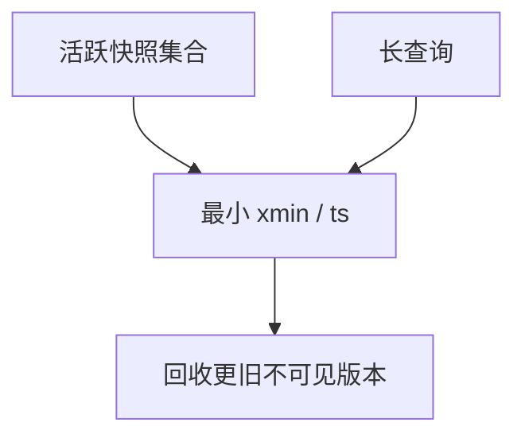

# MVCC 版本回收

旧版本必须活到所有可能读它的快照结束；GC 的水位是最小活跃快照，不是「提交了就能删」。

<footer>—— 据 Reed MVCC；Bernstein；Postgres vacuum 与 InnoDB purge 对照</footer>

[上一课](/cs/wait-for-graph)处理锁等待环。本课不 DFS。缺口是版本存储的寿命：主干 MVCC 点到 GC。进阶钉水位线：`min(活跃事务快照)` 之前的不可见版本才可物理回收。InnoDB purge undo、Postgres vacuum、LSM 墓碑是同一水位的不同实现。

## 问题

只读长查询钉住旧快照，写者不断产新版本，空间与 undo 链、堆死元组一起涨。缺口是**可见性与回收的耦合**，不是又一种隔离级别。二次索引：指向已删版本的项也要在 GC 时摘掉，否则回表见鬼或浪费。

与 LSM compaction：墓碑不能过水位丢。与延迟物化：RID 在查询中仍用，不能回收那一槽。

水位可全局 xmin，或每索引、每分区。autovacuum/purge 线程是实现。本课合同：GC ≤ 最小读者需要。

## 方法

维护活跃快照集合。GC 线程扫 undo/堆/SST，删版本。跳过仍可见页（可见性映射）。监控：oldest xmin 年龄、undo 体积、堆膨胀——超阈则杀长查询或拒绝新快照（极端）。

只读事务下一课可走不挡写的快照副本，但若仍注册全局 xmin 一样挡。

## 机制

SSI 只读豁免若仍占 xmin 则无豁免于 GC。复制槽、逻辑解码消费者也是「读者」，会钉 WAL 与版本。备份热快照同样。

性能：GC 写 WAL、抢 I/O，与 2Q 扫描污染叠加。节流是运维。

## 边界

本课不讲只读事务的特殊快照安装。也不把 GC 当检查点。检查点是 redo 起点，GC 是版本空间。

后课默认：版本回收水位=最小快照。只读事务与快照：减少锁，仍可能钉水位，除非快照导出到不挡主库 GC 的副本。

没有水位的「立即覆盖」会让快照读到半新行或空洞。

## 小结

- GC 受最小活跃快照约束；长读者导致膨胀。
- undo/堆/LSM 墓碑是同一水位的不同口袋。
- 只读事务与快照下一课。
- 出处：Reed；Bernstein；vacuum/purge 实践。
