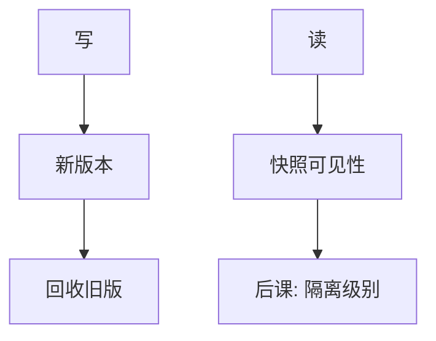

# MVCC

写出新版本而不原地覆盖；读去取自己快照里可见的那一版，读与写不必抢同一把锁。

<footer>—— 据 Reed, Naming and Synchronization in a Decentralized Computer System, 1978；Bernstein 对多版本调度的整理</footer>

[上一课](/cs/strict-2pl)用严格两阶段锁保证可串行，读也要加 S。本课不重讲锁点。缺口是：只读事务被写阻塞，或写被长查询挡住。多版本并发控制让写创建新版本，读按时间戳或快照选可见版本，读锁可以去掉或大大减弱。

## 问题

2PL 的 S 与 X 不兼容，分析查询会挡住更新。缺口不是放弃隔离，而是给每个写一个版本号（事务 id、时间戳），可见性函数回答「这一读能看见哪一版」。快照隔离（SI）是广泛实现：事务开始时钉一个快照，读都来自该快照，写冲突在提交时用写集检测。

SI 避免脏读、不可重复读与部分幻象，但允许写偏斜：两个事务读同一快照、写不同行，各自提交，串行下不可能同时成立。那是后课隔离级别要命名的异常。

## 方法

每行带创建/删除版本。读不阻塞写；写若与未提交或快照后的版本冲突，则 abort 或等待。垃圾回收删除对所有活跃快照都不可见的旧版。本课不把 SSI（可串行快照隔离）的冲突检测写完，只锁定：版本 + 可见性是与锁并列的实现轴。

## 机制

WAL 仍记录什么变了；版本是并发的表示，不是另一种恢复。回滚可以只是标该版本不可见。索引必须指向「当前」版本或带版本的项，B+ 叶上的空间与清理成为新的代价——与[页与槽](/cs/page-slot)的空间回收相接。长只读快照会拖住 GC，这是 MVCC 的资源边界。

写写冲突仍要检测或等待；「读不阻塞写」不等于「写不冲突」。

## 边界

MVCC 不是自动可串行。SI ≠ 冲突可串行。本课也不把「无锁」写成事实：写写仍要检测，字典结构本身仍要闩锁（latch），那是物理短锁，不是 2PL 的事务锁。

只读事务可以拿一个旧快照一直读，写者前进；这是分析负载的常见配置，代价是旧版本堆积。后课默认：引擎可以锁、可以版本、可以混合（写锁 + 读快照）；用户看见的强度用隔离级别与异常来谈，而不是用内部版本号。

快照是时间上的切面，不是另一份数据库。写仍要落 WAL；版本只回答「读看见谁」，不替代提交记录。

## 小结
- 长快照拖住垃圾回收，是 MVCC 的空间账单，不是免费的非阻塞读。
- 后课用异常名字把 SI 与可串行的差额说给应用听。

- 2PL 让读写互斥；MVCC 用版本让读走快照。
- 可见性函数是隔离的实现；SI 仍可能写偏斜。
- 用户侧档位（读已提交、可重复读、可串行）是后课缺口。
- 出处：Reed, 1978；Berenson et al., 1995；Bernstein 多版本章节。
