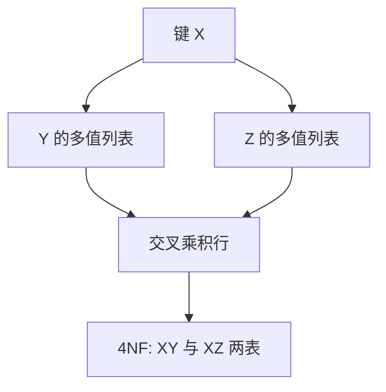

# 多值依赖与 4NF

多值依赖说两套独立事实被塞进同一键下：元组必须交叉出现。4NF 要求这种独立乘积被拆开。

<footer>—— 据 Fagin, Multivalued Dependencies and a New Normal Form, TODS 1977；Beeri, Fagin, Howard；Ramakrishnan and Gehrke</footer>

[上一课](/cs/lossless-dependency-preserving)处理 FD 下的无损与保持。本课不重做 chase。缺口是：即使没有非平凡 FD，一张表仍可被迫存笛卡尔积。课程安排独立、讲师独立，键是课程，却放在同一关系里，行数是两套列表的乘积。多值依赖（MVD）命名这件事；4NF 沿 MVD 分解。

## 问题

MVD $X \twoheadrightarrow Y$（在 $U$ 上）大致：给定 $X$，属性集 $Y$ 与 $U-X-Y$ 独立——合法实例必须包含 $Y$ 值与其余属性值的全部组合。FD 是 MVD 的特例（$Y$ 被 $X$ 唯一决定时组合塌缩）。缺口是识别「独立重复组」，不是再定义 3NF。

4NF：每个非平凡 MVD $X \twoheadrightarrow Y$，$X$ 都是超键。分解：把 $R$ 拆成 $XY$ 与 $X(U-Y)$，无损（对 MVD）。这与 BCNF 切开形状相似，依据从 FD 换成 MVD。

Fagin 1977。补规则与合并规则构成 MVD 公理（与 Armstrong 一起）。本课不默写全部公理，只要求：独立乘积是模式错误，不是「数据恰好这么多」。

## 方法

发现：若业务上「给定课程，教材列表与助教列表无关」，却存在于同一表，则有 MVD。分解后各存一列多值事实，查询要用连接恢复组合——这是正确的组合，不是虚假元组。若业务上并非独立（教材决定助教），则不是 MVD，不能拆。

与 1NF：1NF 禁止表中表；把多值拆成多行后仍可能留在一张宽表里造成乘积。4NF 是 1NF 之后、针对独立多值的下一刀。

## 机制

BCNF 过、4NF 不过：没有非平凡 FD，但仍有非平凡 MVD。主干范式课故意不把 4NF 写进必做；进阶在此补层。连接恢复的是独立组合的全积，与业务「确实独立」一致。

保持性对 MVD 更细，本课不把 MVD 保持当必考算法。实践：识别独立多值并拆表，约束用键。

## 边界

本课不讲 5NF（投影-连接依赖）——下一课。也不把 JSON 数组列当成自动 4NF 违反；嵌套是另一数据模型，是否独立仍是语义问题。NULL 与 MVD 的理论更窄，工程上先把列表拆成关系。

后课默认：独立多值事实分表。5NF 处理「三次投影才能无损」的连接依赖，更稀，但反规范化会反过来走。

MVD 不是「多值属性」的同义词；它是合法实例上的交叉条件。

## 小结

- MVD 刻画键下两套独立列表的交叉乘积。
- 4NF 沿非平凡 MVD 切开，X 须为超键。
- 5NF 与反规范化下一课：何时再连回去。
- 出处：Fagin 1977；Beeri, Fagin, Howard；Ramakrishnan and Gehrke。
