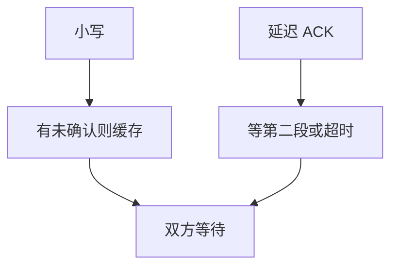

# Nagle 与延迟 ACK

小段太密会浪费头开销；Nagle 等一个 ACK 再发新的小段。接收方延迟 ACK 想捎带，两套等待叠在一起就会卡住。

<footer>—— 据 Nagle, RFC 896；RFC 1122 对延迟 ACK；Kurose and Ross</footer>

[上一课](/cs/tcp-window)用 `rwnd` 防止淹没对端。本课不重讲滑动窗口。缺口是交互式与 RPC 式负载：一次写几个字节，每个都独立成段，头比载荷大；另一方面接收方为了把 ACK 与反向数据合并而等待。两者各自合理，合在一起造成 **ACK 死锁式延迟**。拥塞窗口下一课才出现。

## 问题

Nagle：若有未确认数据，就把后续小写缓存，直到 ACK 到来或凑满 MSS。延迟 ACK：不立刻确认每个段，等一小段时间或等到两个段。若发送方等 ACK 才发下一小段，接收方等第二段才 ACK，双方都在等。缺口是**把流控窗口里的发送时机写清**，不是新的序号规则。

关闭 Nagle（TCP_NODELAY）是应用在「延迟敏感、载荷小」时的选择，不是协议错误。延迟 ACK 也有上限，避免无限等。

## 方法

实现按 RFC 896 与主机需求（RFC 1122）组合：大块传输几乎不受 Nagle 影响（很快满 MSS）；请求–响应当两端都小段时最疼。修复是打破其中一侧等待：禁 Nagle，或更及时的 ACK。本课不把应用层缓冲策略写成框架教程。

## 机制

Nagle 减的是报文率，保护的是共享路径上的头开销；延迟 ACK 减的是纯 ACK 报文。它们优化的是性能，不改变 RFC 793 的可靠性。[端到端](/cs/layering-e2e) 字节流语义仍在；变的是何时离开 Nagle 缓冲区。后课拥塞控制会再叠一层「飞行中能有多少 MSS」。

## 边界

本课不引入全部 Cork 与自动 Corking 的平台细节。网络队列满时即使 rwnd 很大也不能发，下一课用 `cwnd`。

后课默认：小段可能被故意推迟。瓶颈队列的公平与稳定是拥塞控制的缺口。

## 小结

- Nagle 合并小段；延迟 ACK 合并确认。
- 两套等待叠加会放大 RTT。
- 保护网络队列是下一课拥塞控制。
- 出处：RFC 896；RFC 1122；Kurose and Ross。
