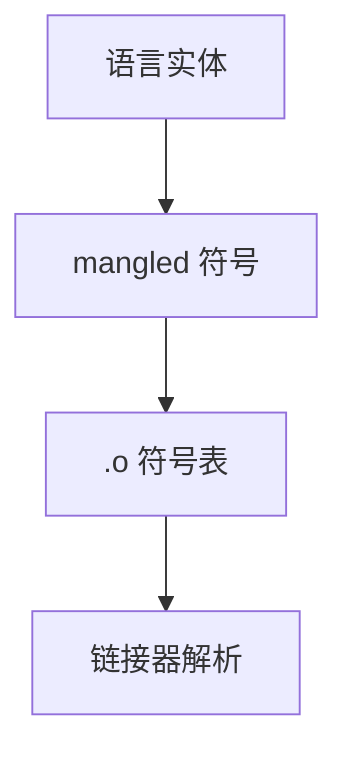

# 符号与 mangling

链接器只认字节串名字。C++ 的重载、命名空间、模板要编进一个符号：mangling。调试与 `dlsym` 必须能来回译。

<footer>—— 据 Itanium C++ ABI 名字改编；System V ABI 符号绑定；龙书链接章整理</footer>

上一课[DWARF](/cs/dwarf-debug-info) 里 DIE 有源名。缺口是**目标文件符号表**的名字：C 的 `foo` 常就是 `foo`；C++ 是 `_Z...`。本课钉 mangling 与链接属性（`static`、weak、visibility），下一课序从解析归档开始。

## 问题

两个 `void f(int)` / `void f(double)` 不能同名符号。mangling 把类型签名编进去。模板实例：再编模板实参。缺口是**编码规则与互操作**，不是行号表。

`extern "C"` 关闭 mangling，才能与 C 库链接。Rust/Swift 各有方案，点名。

### mangling 不是卫生宏

宏改源名绑定；mangling 是 ABI 层唯一化。α 换名在编译器内部 IR，符号是对外的。

Itanium C++ ABI。MSVC 用另一套。`c++filt`  demangle。本课以 Itanium 为默认 Unix。

## 方法

前端为每个带链接的实体发 mangled 名。局部符号（`static`）可内部链接，LTO 仍可改名。弱符号：内联、模板在多个 TU 定义，链接器留一份。

与 DWARF：`DW_AT_linkage_name` 存 mangled，`DW_AT_name` 存源名。

## 机制

ABI 不稳：改 mangling = 不能与旧 `.o` 链接。不要手写猜测的 `_Z` 串去 `dlsym`，用 `extern "C"` 或官方工具。

过长符号：模板错误信息膨胀；编译器可截断哈希（谨慎）。

## 边界

本课不写链接器解析算法全文。后课默认：C++ 符号是 mangled 串。下一课链接器符号解析与归档。

也不把 mangling 当混淆器（那是另一层 strip/obfuscate）。

## 小结

- 链接名是扁平字符串；C++ 用 ABI mangling 编码签名。
- `extern "C"` 与 C 互链；弱符号服务模板。
- 调试信息同时保留源名与链接名。
- 出处：Itanium C++ ABI；System V ABI；龙书链接。
