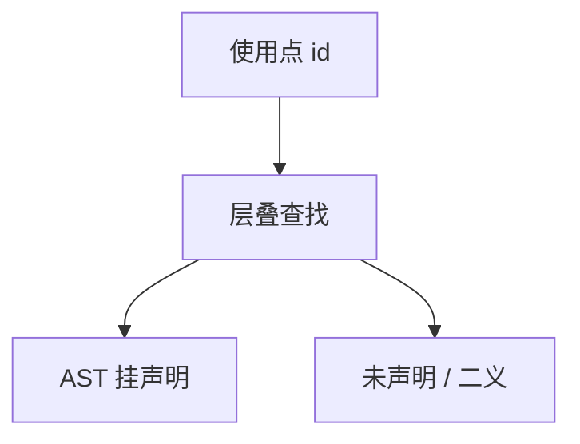

# 名字解析

查找把每个使用点绑到唯一声明（或报未声明、不明确）；此后遍比较的是声明记录，不再比字符串。

<footer>—— 据龙书第 6 章；Appel, Modern Compiler Implementation 整理</footer>

上一课[作用域与符号表](/cs/scope-symtab)给出层叠映射与遮蔽，并声明使用处从内向外查。本课不重做 push/pop。缺口是**解析本身**：把查找结果写回 AST、处理前向引用、限定名与导入路径、以及失败种类（未声明、在声明前使用、二义导入）。类型是否匹配下一课才查；本课可以绑到「还只有占位类型」的记录。

## 问题

符号表是结构；解析是遍：遇声明插入，遇使用查找，节点上挂 `decl` 指针。块结构语言一遍即可。类成员、方法与字段的前向引用要两遍：先收声明，再解析使用。C 的原型与定义、Java 的类体都属于「先建完当前层再查」。缺口是这份次序，不是再解释散列。

限定名 `M.x`：先解析 `M` 到模块或对象，再在那一层查 `x`。导入把外层名字拷进当前查找路径；冲突要报不明确，不能静默挑一个。

### 绑定不是链接

编译单元内的解析结束于本文件能看见的声明。别的 `.o` 里的 `printf` 仍是未定义符号，留给[链接](/cs/link-reloc)。本课失败叫「未声明」；链接失败叫「未定义引用」。不要混。

龙书把符号表查找写成语义分析的一部分。Appel 强调 AST 上替换名字为标签。重载要等类型信息，下一课与再下一课；本课默认同层同名冲突，除非语言规定函数可同名待选。

## 方法

按语言选一遍或两遍访问者。插入时查当前层冲突。查找失败：诊断 + 可插入错误声明以免级联。写回绑定后，后续遍禁止再用标识符拼写当键（宏除外）。

静态链、捕获变量：解析时标记「来自外层函数」，闭包实现后置；本课只记绑定深度。

## 机制

有了指针，改名重构与报错下划线都能指向声明处。[调用约定](/cs/calling-convention-stack) 的槽位尚未分配，记录里的偏移仍空。同名类型与同名变量分属不同名字空间时，查找要带种类——C 的 `struct` 标签即例，点名。

动态作用域不在主干：运行时沿调用链查，编译期绑不紧。

## 边界

本课不检查类型、不做隐式转换、不决议重载。不处理链接期弱符号。后课默认：每个合法使用点有唯一定义指针。类型综合与比对是下一课。

## 小结

- 解析 = 查找 + 写回绑定；前向引用可能要两遍。
- 未声明是前端诊断；未定义引用是链接诊断。
- 重载与类型下一课才进查找键。
- 出处：Aho et al., 龙书第 6 章；Appel。
